# ANALYSIS — Algorithms, Design Decisions, and Performance

Explains why the implementation is structured as it is: the algorithmic
background, key design choices, and measured performance data.

## Relationship to edit distance and common substrings

Differential compression emerged as an application of the
string-to-string correction problem (Wagner and Fischer 1974), which
asks for the minimum-cost sequence of edits transforming one string into
another.  Levenshtein distance (Levenshtein 1966) is the simplest
instance: single-character insertions, deletions, and substitutions,
computed by O(mn) dynamic programming.

Early differencing algorithms solved string-to-string correction by
computing the longest common subsequence (LCS) of strings R and V, then
treating all characters outside the LCS as data to be added explicitly
(Ajtai et al. 2002, Section 1.1).  This formulation assumes a one-to-one
correspondence between matching substrings and requires that they appear
in the same order in both strings.  Tichy (1984) generalized to the
"string-to-string correction problem with block move," which permits
variable-length substrings to be copied multiple times and out of
sequence.  Traditional algorithms for this problem — the greedy
algorithm of Reichenberger (1991) and the dynamic programming approach
of Miller and Myers (1985) — run in O(mn) or O(n^2) time.

The algorithms implemented here (Ajtai et al. 2002) solve the
string-to-string correction problem with block move using Karp-Rabin
fingerprinting (Karp and Rabin 1987) to discover variable-length common
substrings between R and V in linear time.  A single substring in R may
be copied to multiple locations in V, and matches need not preserve
order.  The onepass and correcting algorithms run in O(n) time with O(1)
space — compared to O(mn) for edit-distance dynamic programming.  For
a 1 MB file with a 1 KB change, Levenshtein requires ~10^12 operations;
onepass finds the change in a single linear scan.

## Checkpointing (correcting algorithm)

The correcting algorithm uses checkpointing (Ajtai et al. 2002,
Section 8) to select which seeds enter the hash table.

Two parameters govern the hash table:

- **|C|** = auto-sized table capacity (`next_prime(max(table_size, 2 *
  num_seeds / p))`).  Each entry is ~16 bytes (fingerprint + position,
  8 bytes each).  `--table-size` sets the floor.
- **|F|** ≈ 2|R| (auto-computed): the footprint modulus.  Set to
  `next_prime(2 * num_seeds)` for good distribution.

The checkpoint stride is `m = ⌈|F|/|C|⌉`.  A seed is a **checkpoint
seed** if its footprint `f = fingerprint mod |F|` satisfies `f ≡ k
(mod m)` (Section 8.1, Eq. 3), where `k` is a biased checkpoint class
chosen from V (p. 348).  Only checkpoint seeds are stored in or
looked up from the hash table; all others are skipped.  This gives
~|C|/2 occupied slots (~50% load factor) regardless of |R| (Section 8.1,
p. 347: L · |C|/|F| ≈ |C|/2, hence |F| ≈ 2L).

The checkpoint stride `m` equals the average spacing between checkpoint
seeds.  Matching substrings shorter than ~m bytes may be missed because
none of their seeds pass the checkpoint test.  Longer matches are found
reliably: backward extension (Section 5.1) discovers the true start of
the match even when it falls between checkpoint positions (Section 8.2,
p. 349).

With auto-sizing, `m ≈ p` (the seed length), so checkpoint granularity
roughly matches seed granularity.  When the reference is small enough
that |F| ≤ |C|, the stride is m=1 and every seed is a checkpoint —
equivalent to direct indexing with no filtering overhead.

The footprint modulus |F| is chosen as a prime using a deterministic
Miller-Rabin primality test with the fixed witness set {2, 3, 5, 7, 11,
13, 17, 19, 23, 29, 31, 37}.  This set is proven sufficient for all n <
3,317,044,064,679,887,385,961,981 (> 2^81), far exceeding any table
size that arises in practice (Jaeschke, Math. Comp. 61(204), 1993).
No random number generator is required: the result is deterministic and
identical across all nine language implementations.

## Splay tree: design and tradeoffs

The splay tree option (`--splay`) replaces the hash table with a
Tarjan-Sleator self-adjusting binary search tree (Sleator and Tarjan 1985).
Every access splays the accessed node to the root via zig/zig-zig/zig-zag
rotations, giving amortized O(log n) per operation.

**Onepass:** onepass inserts a seed from R and then looks it up shortly
after when it scans the corresponding V region.  The splay tree exploits
this temporal locality in principle, but O(log n) rotations per access
outweigh the locality benefit in practice: on 871 MB kernel tarballs the
splay tree is ~55% slower than the hash table in algorithm time (0.78s
vs 0.50s).  Total wall time is dominated by I/O (~3.5s reading two 871 MB
files), so the algorithm-time difference is masked.

**Why it hurts for correcting:** correcting's R pass inserts millions
of checkpoint seeds in random order before any V lookups begin.  The
build phase has no locality benefit, and O(log n) per insertion is
slower than O(1) hash table insertion.  Lookups during the V pass also
lack the recent-access advantage.  On kernel tarballs, correcting+splay
is ~7.5× slower in algorithm time (44s vs 5.9s).

**Why splay improves correcting ratio:** the hash table indexes seeds by
`f / m` (where `f = fp % |F|`), so two seeds with the same `f / m`
collide and only the first is retained.  The splay tree keys on the full
64-bit fingerprint, making collisions negligible: every checkpoint-passing
R seed gets its own node.  Splay stores more fingerprints and finds more
matches, yielding slightly better compression at the cost of O(log n)
lookups.  On the cross-version kernel pairs below, splay consistently
beats hash by 0.01–0.02 percentage points on correcting ratio.

**Practical access cost:** the O(log n) characterization is a worst-case
amortized bound.  A fingerprint appearing k times in R is splayed to the
root k times during the build phase, so the most common fingerprints are
near the root by the time the V scan begins.  For a Zipfian frequency
distribution — which natural language and source code both follow closely
— the weighted average access cost is O(log H) where H is the entropy of
the distribution, substantially less than O(log n).  On kernel tarballs
the effect is visible: common boilerplate dominates the fingerprint
distribution, limiting the practical slowdown to ~7.5× algorithm-only
rather than what an adversarial access pattern would produce.

## Delta integrity verification

Every delta file embeds two 8-byte CRC-64/XZ checksums in its header:
`src_crc` (CRC of the reference file) and `dst_crc` (CRC of the
reconstructed version).  Decode performs two checks:

- **Pre-check** (before reconstruction): `crc64_xz(ref) == src_crc`.
  Catches wrong-reference errors immediately, before any computation.
- **Post-check** (after reconstruction): `crc64_xz(output) == dst_crc`.
  Catches corruption in the delta file itself or any bug in the apply
  phase.

CRC-64/XZ (ECMA-182 reflected, polynomial `0x42F0E1EBA9EA3693`)
was chosen for speed: software implementations run at ~12 GB/s, making
the overhead negligible even on multi-gigabyte kernel tarballs.  The
8-byte output gives a 2^{-64} probability of an undetected random error,
sufficient for accidental-error detection in delta workflows.  All nine
implementations use the same table-driven algorithm (reflected polynomial
`0xC96C5795D7870F42`, init = xorout = `0xFFFFFFFFFFFFFFFF`), verified
against the standard check value `crc64_xz(b"123456789") =
0x995DC9BBDF1939FA`.

The `--ignore-hash` decode flag replaces both error exits with stderr
warnings and continues, providing an escape hatch for partial recovery
from a corrupted or mismatched delta.  The library itself does not
enforce the checks; CRC validation is the caller's responsibility.

## In-place conversion: CRWI graph and cycle breaking

In-place reconstruction writes the version V directly into the buffer
holding the reference R, without a separate output buffer.  This requires
that a copy command reading from R[src..src+len] execute before any copy
command that overwrites that region.

### The CRWI digraph

The dependency relation is captured by the Copy-Read/Write-Intersection
(CRWI) digraph (Burns, Long, and Stockmeyer 2003): edge i → j means
copy i reads a region that copy j will write, so i must execute before j.
If this graph is acyclic, a topological sort gives a safe execution order.
If it contains a cycle, the commands in the cycle cannot all be copies —
at least one must be converted to a literal add (materializing the source
data before it is overwritten).

The CRWI graph is built in O(n log n + E): copies are sorted by write
start, and for each copy's read interval a binary search finds the exact
range of overlapping writes in O(log n), exploiting the fact that write
intervals are non-overlapping (each output byte is written exactly once).

### Cycle breaking: Kahn + Tarjan + amortized DFS

A naïve approach — remove vertices one-by-one until the graph is acyclic
— can convert far more copies than necessary if it ignores the global
structure.  The correct algorithm combines three ideas:

1. **Global Kahn topological sort** processes all zero-in-degree copies
   first, in order of increasing length (to minimize the total size of
   any forced adds).  When a copy is processed, its out-edges are removed
   and successors whose in-degree drops to zero are added to the queue.
   This preserves the **cascade effect**: converting one copy to an add
   globally decrements in-degrees across SCC boundaries, potentially
   freeing other copies for free.

2. **Tarjan SCC decomposition** identifies the strongly connected
   components of the CRWI graph before Kahn begins.  SCCs are processed
   in topological order (sources first); non-trivial SCCs (size > 1)
   are the only ones that contain cycles and need cycle-breaking attention.

3. **Per-SCC amortized DFS** finds a cycle within one SCC, selects the
   minimum-length copy in that cycle as the victim, and converts it to
   an add.  Three amortizations ensure O(|SCC| + E_SCC) total work per
   SCC, not O(|SCC|) per stall:

   - **scc_id filter (O(1) per neighbor):** Instead of setting and
     clearing a `member[]` bitmap for each stall — O(|SCC|) per call —
     the DFS checks `scc_id[w] != sid || removed[w]` in O(1).
     The global `scc_id[]` array is precomputed by Tarjan and never
     modified; the scc_id filter isolates one SCC without any per-call
     sweep.

   - **color=2 persistence:** DFS colors vertices gray (1) when on the
     path and black (2) when fully explored.  Black vertices persist
     across calls within the same SCC.  This is monotone-correct:
     removing a vertex can only reduce edges, never introduce new cycles,
     so a vertex with no reachable cycle remains cycle-free after any
     removal.  Total DFS work per SCC is O(|SCC| + E_SCC) amortized
     across all stalls, not O(|SCC|) per stall.

   - **scan_start:** the outer DFS loop resumes from where the last call
     left off, accumulating O(|SCC|) total outer-loop work per SCC
     instead of O(|SCC|) per stall.

   On cycle found, only the gray (color=1) vertices on the cycle path
   are reset to 0; black (color=2) vertices are untouched.  An
   `scc_active[id]` counter tracks live members, giving O(1) SCC
   exhaustion checks in the global Kahn loop.

### Why per-SCC local Kahn is wrong

An earlier approach used Tarjan SCC plus a *local* Kahn sort within each
SCC, computing in-degrees only among within-SCC edges.  This loses the
**global cascade effect**: when a victim is converted, the global in-degree
decrement can free copies in other SCCs at no additional conversion cost.
Local Kahn misses this, producing 56% more conversions (16,048 vs 10,265
at 16 MB 100% permutation) and significantly worse compression ratios
(0.4036 vs 0.2569).

### Complexity

CRWI graph build: O(n log n + E).
Kahn + Tarjan + amortized DFS: O(n log n + E) (Kahn heap is O(n log n);
Tarjan and amortized DFS are O(n + E)).
Total: O(n log n + E).

---

## Test scripts

| Script | Purpose |
|--------|---------|
| `tests/correctness.sh` | Builds all nine implementations and runs unit tests + cross-language compatibility (208/56/64/45/52/52/52/52 unit tests + Haskell build/smoke) |
| `tests/kernel-delta-test.sh` | Performance benchmark on Linux 5.1.0–5.1.7 kernel tarballs (~871 MB each) |
| `tests/transposition-benchmark.sh` | Performance benchmark on synthetic block permutations (16 MB–1 GB) |
| `tests/per-language-benchmark.sh` | Per-language speed comparison (all 9 implementations, linux-5.1.0→5.1.1) |
| `tests/get_shakespeare.sh` | Download Shakespeare (PG #100) and generate mutated versions for bench_all.sh |
| `bench_rust.sh` | Rust micro-benchmarks via pilot-bench (1 MiB synthetic data, MiB/s with CI) |
| `bench_all.sh` | All 9 languages via pilot-bench (Shakespeare ~5.4 MB, 5% mutations, MiB/s with CI) |

`tests/correctness.sh` is the primary correctness gate: it runs all unit
suites, executes Haskell build/smoke checks, and verifies cross-language
compatibility (including Haskell lanes when `delta-hs` is present).  The
benchmark scripts are separate so they can be run independently without
the multi-GB data requirements of the kernel tests.  For statistically
rigorous CI, use `bench_rust.sh` or `bench_all.sh` (require pilot-bench;
see [BENCHMARKING.md](BENCHMARKING.md)).

## Performance benchmarks

### Kernel tarball benchmark (linux-5.1 → linux-5.1.1, 871 MB)

Eight compiled implementations, same input pair, default flags.  All produce
byte-identical delta files.  Python is excluded (see section header).

**onepass** (delta: 4.8 MB, ratio: 0.58%)

| Implementation | Time (Dyson / M4) |
|----------------|------------------:|
| C              | 4.0s |
| Rust           | 4.5s |
| C++            | 4.5s |
| Go             | 4.9s |
| Haskell        | 5.1s |
| Java           | 6.0s |
| Kotlin         | 6.1s |
| Scala          | 6.2s |

**correcting** (delta: 6.6 MB, ratio: 0.79%)

| Implementation | Time (Dyson / M4) |
|----------------|------------------:|
| Rust           |  9.9s |
| Java           | 12.3s |
| Scala          | 13.2s |
| Go             | 14.1s |
| Kotlin         | 14.1s |
| Haskell        | 17.5s |
| C              | 19.2s |
| C++            | 19.4s |

C leads on onepass; Rust dominates correcting by ~20%.  Haskell (STUArray
hot paths with reduced heap churn) overtakes the entire JVM group on onepass,
landing between Go and Java.  The JVM group (Java/Kotlin/Scala) clusters near
the top on correcting — the JIT optimises the inner hash-probe loop well on a
warm run.  C and C++ are slower than the JVM on correcting; the hash table
implementation has not been tuned as aggressively as in Rust.  These
are single-run measurements; use `bench_all.sh` for statistically rigorous CI.
Radar views below use Mermaid `radar-beta` with the same underlying data
(time-based plots are converted to normalized speed scores where faster=larger).

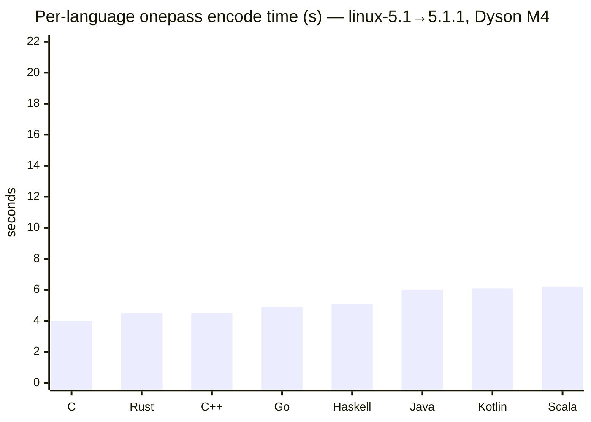
```mermaid
xychart-beta
    title "Per-language onepass encode time (s) — linux-5.1→5.1.1, Dyson M4"
    x-axis ["C", "Rust", "C++", "Go", "Haskell", "Java", "Kotlin", "Scala"]
    y-axis "seconds" 0 --> 22
    bar [4.0, 4.5, 4.5, 4.9, 5.1, 6.0, 6.1, 6.2]
```

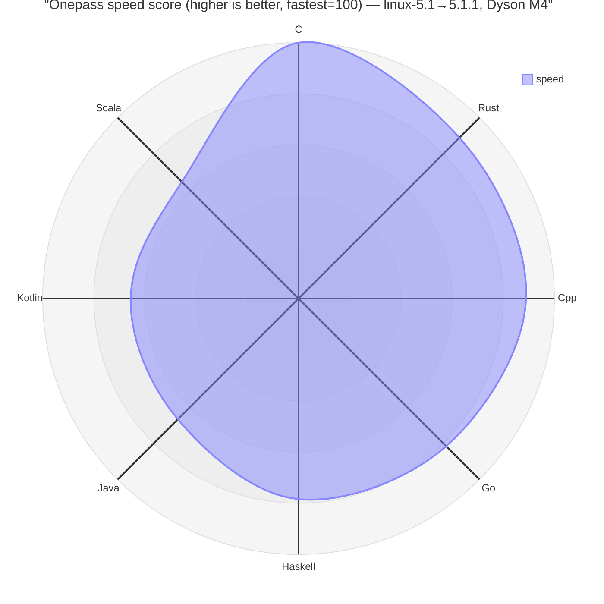
```mermaid
radar-beta
    title "Onepass speed score (higher is better, fastest=100) — linux-5.1→5.1.1, Dyson M4"
    axis C, Rust, Cpp, Go, Haskell, Java, Kotlin, Scala
    curve speed{100.0, 88.9, 88.9, 81.6, 78.4, 66.7, 65.6, 64.5}
```

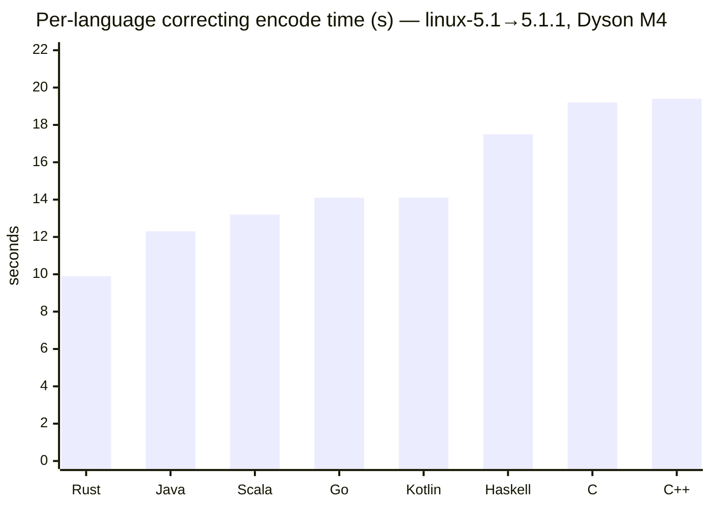
```mermaid
xychart-beta
    title "Per-language correcting encode time (s) — linux-5.1→5.1.1, Dyson M4"
    x-axis ["Rust", "Java", "Scala", "Go", "Kotlin", "Haskell", "C", "C++"]
    y-axis "seconds" 0 --> 22
    bar [9.9, 12.3, 13.2, 14.1, 14.1, 17.5, 19.2, 19.4]
```

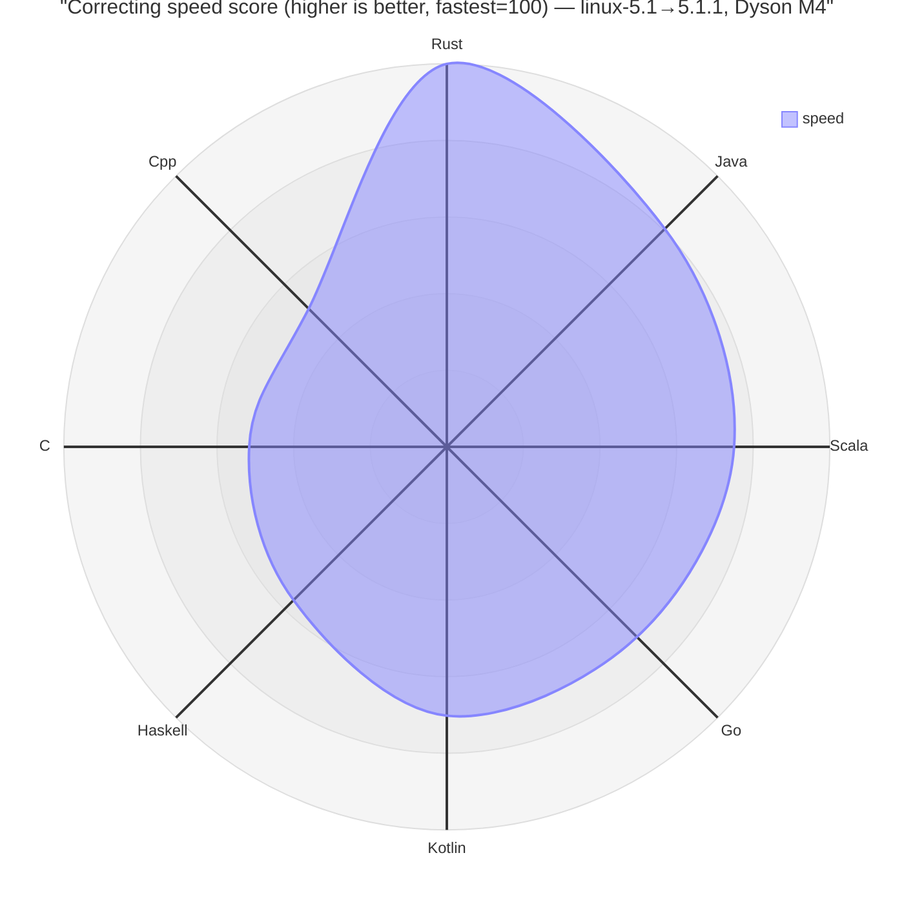
```mermaid
radar-beta
    title "Correcting speed score (higher is better, fastest=100) — linux-5.1→5.1.1, Dyson M4"
    axis Rust, Java, Scala, Go, Kotlin, Haskell, C, Cpp
    curve speed{100.0, 80.5, 75.0, 70.2, 70.2, 56.6, 51.6, 51.0}
```

### Haskell performance note: purity at the API, mutability in hot loops

The Haskell implementation is pure at the public API boundary and does
not use C wrappers/FFI, but a purely persistent internal design was
too slow for the kernel workload.  The main bottlenecks were:

- `IntMap`-based seed tables in onepass/correcting (`O(log n)` plus heavy allocation).
- `Integer` allocations in the rolling-hash modular multiply path.
- Quadratic overlap checks in early CRWI graph construction.

To close the gap, the implementation now uses scoped local mutability
in hot loops (`STUArray`/unboxed arrays) while preserving deterministic,
byte-compatible output:

- Direct-addressed mutable slot tables for onepass and correcting.
- `Word64` Mersenne reduction for `2^61 - 1` (no per-multiply `Integer` heap traffic).
- Interval-sweep CRWI edge construction (`O(n log n + E)`).

Measured on linux-5.1 → linux-5.1.1 on Dyson (M4):
Rust = 4.5s onepass / 9.9s correcting, Haskell = 5.1s onepass /
17.5s correcting.  Earlier purely persistent versions were over 100s
on correcting for the same pair, so local mutability was the primary
performance lever.  The onepass improvement from 6.2s to 5.1s (−18%)
came from eliminating per-iteration heap allocation in the seed-table
inner loop.

### Throughput with confidence intervals (pilot-bench, Shakespeare)

Shakespeare's complete works (~5.4 MB ref, 5% byte mutations as version).
Metric: MiB/s (reference file size ÷ elapsed encode time), 95% CI via
pilot-bench.  Dyson (Apple M4).

**onepass**

| Language | MiB/s | ±CI (95%) | Runs |
|----------|------:|----------:|-----:|
| Rust     | 49.33 | ±4.75 |  30 |
| Go       | 44.49 | ±4.14 |  30 |
| C        | 34.19 | ±2.18 |  30 |
| C++      | 30.87 | ±2.21 |  30 |
| Java     | 25.35 | ±0.93 |  42 |
| Haskell  | 23.71 | ±0.79 |  37 |
| Kotlin   | 21.93 | ±1.04 |  36 |
| Scala    | 17.09 | ±0.56 |  30 |

**correcting**

| Language | MiB/s | ±CI (95%) | Runs |
|----------|------:|----------:|-----:|
| Rust     | 54.56 | ±2.13 |  30 |
| Go       | 37.12 | ±0.52 |  67 |
| C        | 30.54 | ±0.55 | 105 |
| C++      | 29.09 | ±0.87 |  30 |
| Java     | 23.99 | ±0.46 |  36 |
| Haskell  | 23.11 | ±0.40 |  31 |
| Kotlin   | 21.30 | ±0.48 |  37 |
| Scala    | 16.00 | ±0.30 |  30 |

On the small Shakespeare workload (5.4 MB, no I/O bottleneck), the ranking
shifts vs. the 871 MB kernel tarball: Rust leads by a wide margin (LLVM
vectorises the inner loop aggressively at small-file scale), Go sits second
(GC adds less overhead than JVM startup), and the JVM languages spread out
(Scala falls behind Java/Kotlin due to JIT warmup cost).  Haskell (STUArray
hot paths, reduced heap churn) now lands between Java and Kotlin on onepass,
and beats Kotlin while nearly matching Java on correcting.

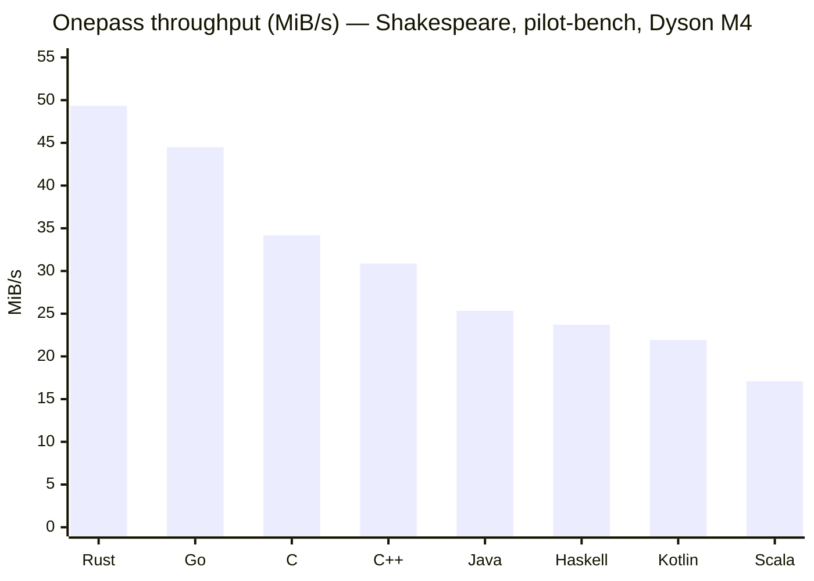
```mermaid
xychart-beta
    title "Onepass throughput (MiB/s) — Shakespeare, pilot-bench, Dyson M4"
    x-axis ["Rust", "Go", "C", "C++", "Java", "Haskell", "Kotlin", "Scala"]
    y-axis "MiB/s" 0 --> 55
    bar [49.33, 44.49, 34.19, 30.87, 25.35, 23.71, 21.93, 17.09]
```

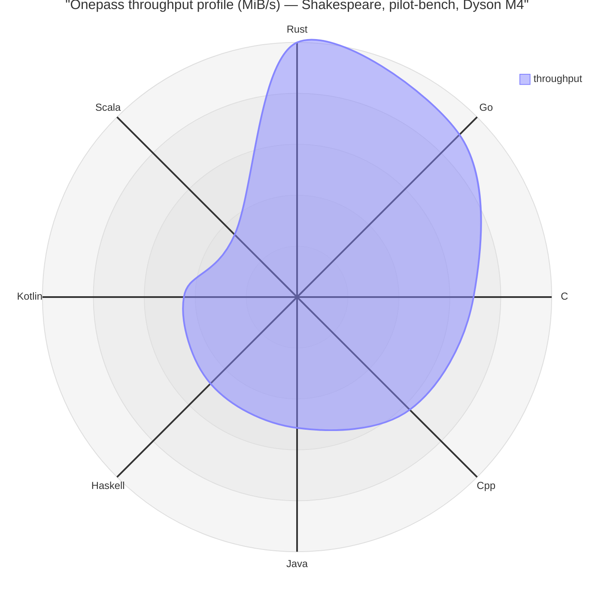
```mermaid
radar-beta
    title "Onepass throughput profile (MiB/s) — Shakespeare, pilot-bench, Dyson M4"
    axis Rust, Go, C, Cpp, Java, Haskell, Kotlin, Scala
    curve throughput{49.33, 44.49, 34.19, 30.87, 25.35, 23.71, 21.93, 17.09}
```

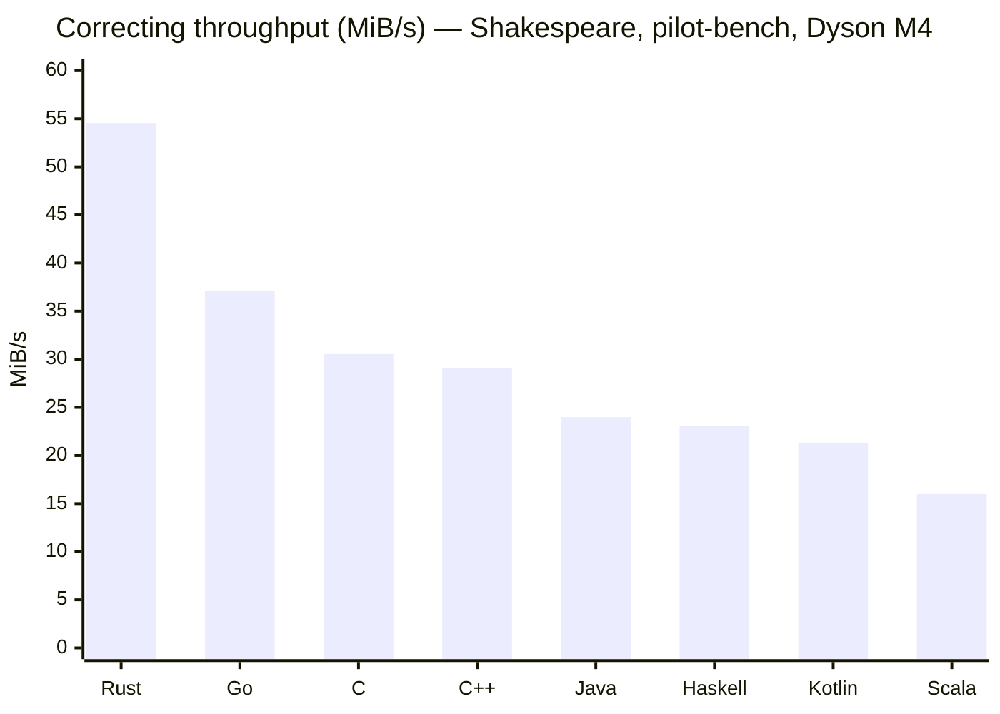
```mermaid
xychart-beta
    title "Correcting throughput (MiB/s) — Shakespeare, pilot-bench, Dyson M4"
    x-axis ["Rust", "Go", "C", "C++", "Java", "Haskell", "Kotlin", "Scala"]
    y-axis "MiB/s" 0 --> 60
    bar [54.56, 37.12, 30.54, 29.09, 23.99, 23.11, 21.30, 16.00]
```

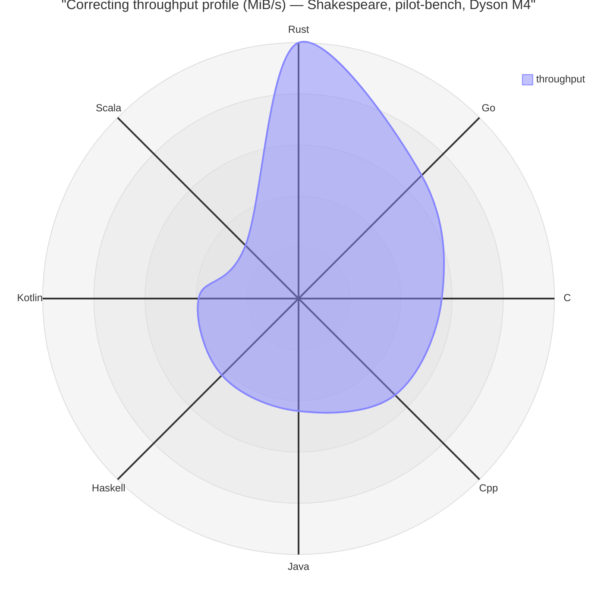
```mermaid
radar-beta
    title "Correcting throughput profile (MiB/s) — Shakespeare, pilot-bench, Dyson M4"
    axis Rust, Go, C, Cpp, Java, Haskell, Kotlin, Scala
    curve throughput{54.56, 37.12, 30.54, 29.09, 23.99, 23.11, 21.30, 16.00}
```

### Multi-machine throughput comparison

Benchmarks run on three machines to characterize per-CPU performance and
determine whether delta compression is CPU-bound or I/O-bound.

| Machine | CPU | RAM | Storage |
|---------|-----|-----|---------|
| Dyson (local) | Apple M4 | 24 GB | Internal NVMe SSD |
| Wigner | Apple M1 Max | 64 GB | QNAP RAID-5 HDD array |
| DMZ | Intel Core i5-8259U @ 2.30 GHz | 30 GB | Internal SSD / `/archive` HDD |

#### Rust micro-benchmarks (bench_rust.sh, 1 MiB in-memory, MiB/s)

Operations use 1 MiB of LCG-generated data with ~5% single-byte mutations.
No disk I/O — results are pure CPU performance.

| Operation | M4 (Dyson) | ±CI | M1 Max (Wigner) | ±CI | i5-8259U (DMZ) | ±CI |
|-----------|----------:|----:|----------------:|----:|---------------:|----:|
| encode_greedy_1m | 10.87 | ±0.12 | 9.38 | ±0.02 | 2.42 | ±0.02 |
| encode_onepass_1m | 60.93 | ±0.66 | 63.60 | ±0.19 | 14.42 | ±0.06 |
| encode_correcting_1m | 32.49 | ±1.51 | 29.44 | ±0.05 | 14.25 | ±0.32 |
| decode_1m | 1046 | ±12.2 | 739.4 | ±0.84 | 614.9 | ±6.3 |
| inplace_1m | 387.2 | ±4.67 | 286.4 | ±0.37 | 167.7 | ±4.1 |

The M4 and M1 Max are within ~4% on onepass but diverge on correcting (~10%)
and decode (~29%).  The Intel i5-8259U is 4–5× slower than Apple Silicon
on compute-intensive paths.

#### Per-language kernel tarball (per-language-benchmark.sh, linux-5.1→5.1.1, 871 MB)

**onepass**

| Language | M4 (Dyson) | M1 Max (Wigner) | i5-8259U (DMZ) |
|----------|----------:|----------------:|---------------:|
| C        | 4.0s | 5.3s |  5.5s |
| Rust     | 4.5s | 5.7s |  6.4s |
| C++      | 4.5s | 6.0s |  6.5s |
| Go       | 4.9s | 7.0s |  7.7s |
| Haskell  | 5.1s | 7.2s |  8.6s |
| Java     | 6.0s | 8.9s | 10.6s |
| Kotlin   | 6.1s | 8.9s | 10.6s |
| Scala    | 6.2s | 9.0s | 10.7s |

**correcting**

| Language | M4 (Dyson) | M1 Max (Wigner) | i5-8259U (DMZ) |
|----------|----------:|----------------:|---------------:|
| Rust     |  9.9s | 12.6s | 22.1s |
| Java     | 12.3s | 16.3s | 30.8s |
| Scala    | 13.2s | 17.7s | 35.1s |
| Go       | 14.1s | 18.1s | 35.9s |
| Kotlin   | 14.1s | 15.6s | 32.9s |
| Haskell  | 17.5s | 21.8s | 41.1s |
| C        | 19.2s | 25.0s | 27.8s |
| C++      | 19.4s | 25.5s | 26.9s |

#### Per-language throughput (bench_all.sh, Shakespeare ~5.4 MB, 5% mutations, MiB/s)

**onepass**

| Language | M4 (Dyson) | M1 Max (Wigner) | i5-8259U (DMZ) |
|----------|----------:|----------------:|---------------:|
| Rust     | 49.33 | 42.53 | 17.66 |
| Go       | 44.49 | 32.30 | 11.97 |
| C        | 34.19 | 25.17 | 15.23 |
| C++      | 30.87 | 23.47 | 15.14 |
| Java     | 25.35 | 18.33 | 10.39 |
| Haskell  | 23.71 | 14.09 |  7.96 |
| Kotlin   | 21.93 | 16.34 |  8.10 |
| Scala    | 17.09 | 12.89 |  6.70 |

**correcting**

| Language | M4 (Dyson) | M1 Max (Wigner) | i5-8259U (DMZ) |
|----------|----------:|----------------:|---------------:|
| Rust     | 54.56 | 42.22 | 19.71 |
| Go       | 37.12 | 28.18 | 10.74 |
| C        | 30.54 | 21.28 | 15.92 |
| C++      | 29.09 | 20.66 | 13.81 |
| Java     | 23.99 | 18.47 |  9.80 |
| Haskell  | 23.11 | 18.38 |  8.42 |
| Kotlin   | 21.30 | 16.43 |  8.68 |
| Scala    | 16.00 | 12.00 |  6.34 |

All eight compiled implementations measured on all three machines.  The M4
and M1 Max deliver similar throughput (Rust within ~15%, others within ~20%).
The i5-8259U is 2.5–3× slower on native code, but the JVM cluster compresses
to a smaller gap (~2×) due to JIT normalization.  Haskell on DMZ matches or
beats Scala and Kotlin on correcting, consistent with the STUArray hot-path
optimisation being less sensitive to CPU generation than the JIT tier-up delay.

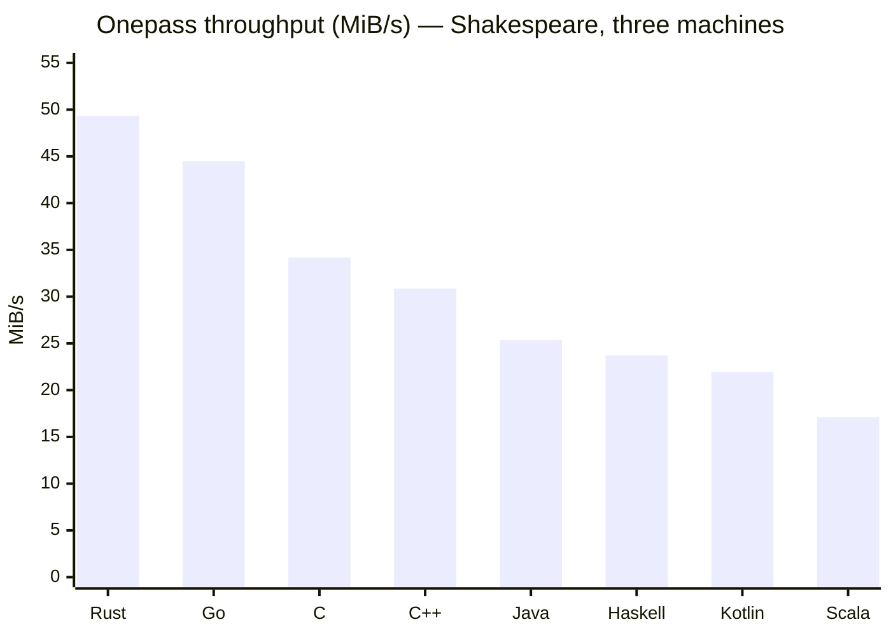
```mermaid
xychart-beta
    title "Onepass throughput (MiB/s) — Shakespeare, three machines"
    x-axis ["Rust", "Go", "C", "C++", "Java", "Haskell", "Kotlin", "Scala"]
    y-axis "MiB/s" 0 --> 55
    bar [49.33, 44.49, 34.19, 30.87, 25.35, 23.71, 21.93, 17.09]
```

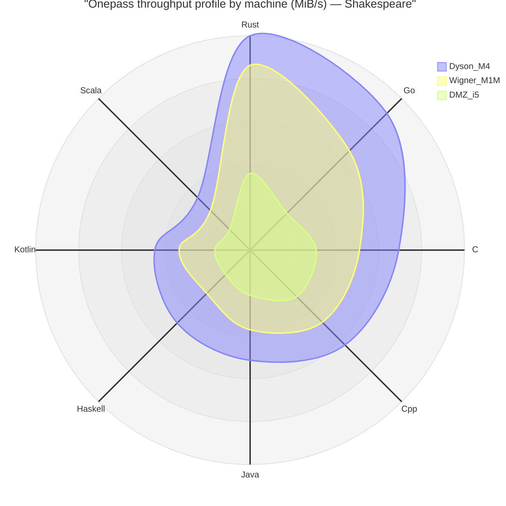
```mermaid
radar-beta
    title "Onepass throughput profile by machine (MiB/s) — Shakespeare"
    axis Rust, Go, C, Cpp, Java, Haskell, Kotlin, Scala
    curve Dyson_M4{49.33, 44.49, 34.19, 30.87, 25.35, 23.71, 21.93, 17.09}
    curve Wigner_M1Max{42.53, 32.30, 25.17, 23.47, 18.33, 14.09, 16.34, 12.89}
    curve DMZ_i5{17.66, 11.97, 15.23, 15.14, 10.39, 7.96, 8.10, 6.70}
```

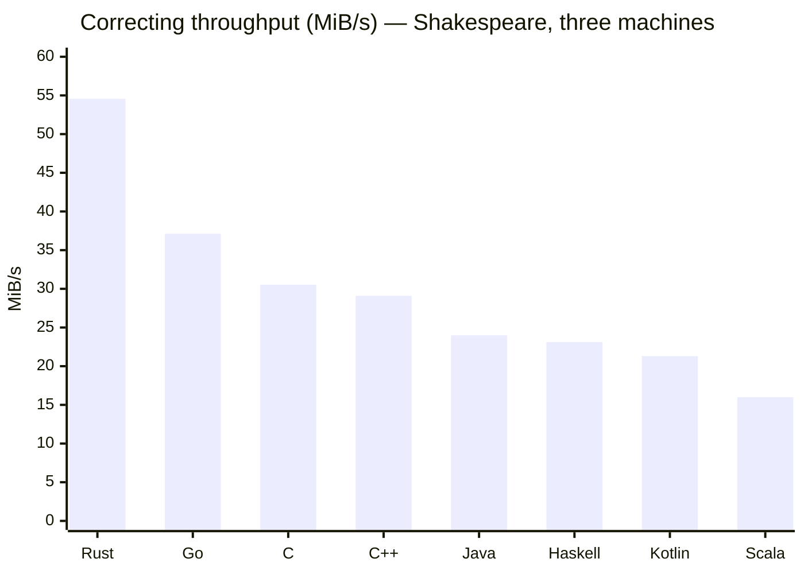
```mermaid
xychart-beta
    title "Correcting throughput (MiB/s) — Shakespeare, three machines"
    x-axis ["Rust", "Go", "C", "C++", "Java", "Haskell", "Kotlin", "Scala"]
    y-axis "MiB/s" 0 --> 60
    bar [54.56, 37.12, 30.54, 29.09, 23.99, 23.11, 21.30, 16.00]
```

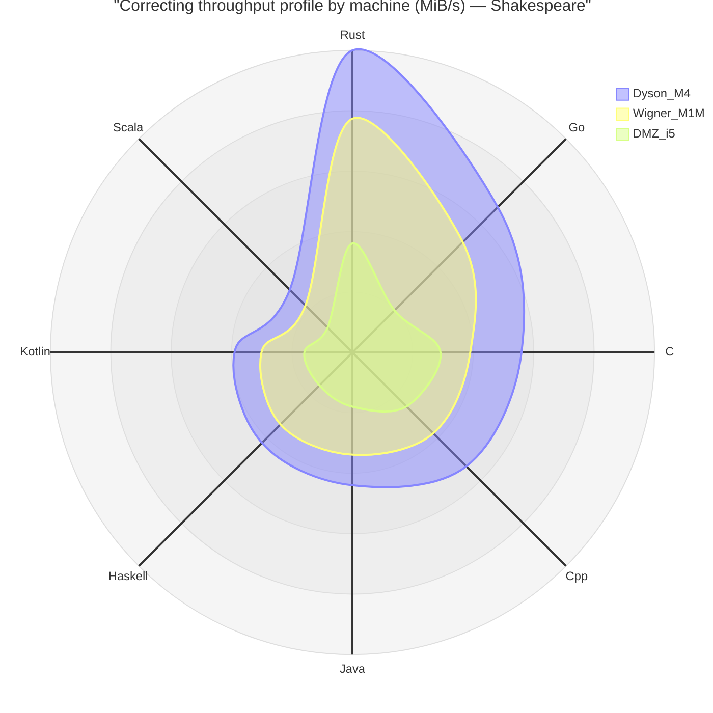
```mermaid
radar-beta
    title "Correcting throughput profile by machine (MiB/s) — Shakespeare"
    axis Rust, Go, C, Cpp, Java, Haskell, Kotlin, Scala
    curve Dyson_M4{54.56, 37.12, 30.54, 29.09, 23.99, 23.11, 21.30, 16.00}
    curve Wigner_M1Max{42.22, 28.18, 21.28, 20.66, 18.47, 18.38, 16.43, 12.00}
    curve DMZ_i5{19.71, 10.74, 15.92, 13.81, 9.80, 8.42, 8.68, 6.34}
```

#### CPU-bound vs I/O-bound: kernel tarball SSD vs HDD on wigner

The kernel tarball benchmark (linux-5.1.0 → 5.1.1, 871 MB each, single run)
was run on wigner with data on the internal Apple SSD (`/tmp`) and on the
QNAP RAID-5 HDD array (`/Volumes/Archive`):

**onepass**

| Language | SSD (/tmp) | HDD (/Volumes/Archive) |
|----------|----------:|----------------------:|
| Rust |  5.4s |  5.4s |
| C++ |  6.1s |  6.3s |
| C |  5.4s |  5.6s |
| Java |  8.9s |  9.2s |
| Go |  6.9s |  6.9s |
| Kotlin |  8.9s |  9.1s |
| Scala |  9.0s |  9.1s |

**correcting**

| Language | SSD (/tmp) | HDD (/Volumes/Archive) |
|----------|----------:|----------------------:|
| Rust | 12.4s | 12.4s |
| C++ | 25.5s | 25.7s |
| C | 25.0s | 25.2s |
| Java | 16.3s | 16.4s |
| Go | 18.1s | 18.5s |
| Kotlin | 15.4s | 15.7s |
| Scala | 17.6s | 18.1s |

All languages agree within ~5% between SSD and HDD.

**Conclusion: delta compression is CPU-bound.**  The 871 MB kernel tarballs
(1.74 GB total) fit comfortably in wigner's 64 GB page cache after Python
reads them; all subsequent languages read from RAM.  SSD and HDD produce
essentially identical throughput.  To expose genuine I/O effects, files
larger than available RAM (or explicit cache-flushing between runs) are required.

---

**Rust, default vs `--splay`**

| Algorithm | Flags | Time | Delta | Copies | Median copy |
|-----------|-------|-----:|------:|-------:|------------:|
| onepass | (default) | 4s | 4.8 MB | 205,030 | 89 B |
| onepass | `--splay` | 4s | 4.8 MB | 205,030 | 89 B |
| correcting | (default) | 9s | 6.6 MB | 243,756 | 91 B |
| correcting | `--splay` | 47s | 6.6 MB | 243,756 | 91 B |

The copy-length distribution is heavy-tailed: median is 89–91 bytes
(barely above the 16-byte seed length), but the mean is 3,600–4,200
bytes and the maximum reaches 14 MB.  Most copies are short, but most
*bytes* come from long copies.

### Integrity-check overhead

Every encode and decode call computes two CRC-64/XZ checksums: one over
the reference file (`src_crc`, pre-checked before reconstruction) and
one over the version or output file (`dst_crc`, verified after).  At
~12 GB/s, checksumming an 871 MB kernel tarball takes ~35 ms — ~70 ms
total overhead per encode or decode, negligible at any algorithm speed.

### Cross-version kernel benchmark (linux-5.1.x, C++)

All six ordered pairs of linux-5.1.1, 5.1.2, and 5.1.3 (~871 MB each),
encoded with the C++ implementation (default flags):

| Ref → Ver | onepass Ratio | onepass Time | correcting Ratio | correcting Time |
|-----------|-------------:|------------:|-----------------:|----------------:|
| 5.1.1 → 5.1.2 | 0.54% | 5s | 0.86% | 19s |
| 5.1.1 → 5.1.3 | 0.55% | 5s | 0.81% | 18s |
| 5.1.2 → 5.1.1 | 0.53% | 4s | 0.81% | 18s |
| 5.1.2 → 5.1.3 | 0.47% | 4s | 1.02% | 18s |
| 5.1.3 → 5.1.1 | 0.54% | 4s | 0.78% | 18s |
| 5.1.3 → 5.1.2 | 0.47% | 4s | 0.85% | 18s |

Onepass is 4–5× faster than correcting and achieves better ratios on
every pair.  Correcting times are nearly uniform (~18s) because encoding
is dominated by the build phase over the 871 MB reference.

### Extended kernel benchmark (linux-5.1.0–5.1.7, Rust)

Three reference modes run with `tests/kernel-delta-test.sh` (Rust, default
flags).  All tarballs are ~871 MB post-gunzip.

**From base: 5.1.0 → 5.1.{1..7}** — fixed reference, cumulative divergence

| Version | onepass ratio | onepass time | correcting ratio | correcting time |
|---------|-------------:|------------:|-----------------:|----------------:|
| 5.1.1 | 0.58% | 3.9s | 0.79% | 9.7s |
| 5.1.2 | 0.65% | 3.9s | 1.00% | 9.7s |
| 5.1.3 | 0.66% | 4.0s | 1.02% | 9.7s |
| 5.1.4 | 0.69% | 4.0s | 1.04% | 9.6s |
| 5.1.5 | 0.70% | 4.0s | 0.85% | 9.8s |
| 5.1.6 | 0.73% | 4.0s | 0.99% | 9.8s |
| 5.1.7 | 0.73% | 3.9s | 0.87% | 10.1s |

Onepass ratios climb steadily as versions accumulate changes from the fixed
5.1.0 base.  Correcting ratios fluctuate: each version's checkpoint bias k
(derived from the midpoint fingerprint of V) varies, affecting how many
seeds survive the checkpoint filter and hence how many matches are found.

**Successive / chain: 5.1.n → 5.1.n+1** — each version against its predecessor

| Transition | onepass ratio | onepass time | correcting ratio | correcting time |
|------------|-------------:|------------:|-----------------:|----------------:|
| 5.1.0→5.1.1 | 0.58% | 4.1s | 0.79% | 9.9s |
| 5.1.1→5.1.2 | 0.53% | 4.1s | 0.84% | 10.2s |
| 5.1.2→5.1.3 | 0.47% | 4.1s | 0.99% | 10.2s |
| 5.1.3→5.1.4 | 0.50% | 4.0s | 0.81% | 10.3s |
| 5.1.4→5.1.5 | 0.48% | 4.1s | 0.78% | 10.2s |
| 5.1.5→5.1.6 | 0.49% | 4.0s | 0.77% | 9.9s |
| 5.1.6→5.1.7 | 0.47% | 4.0s | 0.84% | 10.1s |

Successive onepass deltas (0.47–0.58%) are consistently smaller than
from-base deltas to the same version (0.58–0.73%): each adjacent pair of
kernel releases shares more content than either does with 5.1.0.  Correcting
ratios stay in a similar range either way, showing the algorithm is less
sensitive to reference choice when the checkpoint filter is tuned to the
reference size.

**From 5.1.1: 5.1.1 → 5.1.{2..7}** — fixed non-zero reference, growing divergence

| Version | onepass ratio | onepass time | correcting ratio | correcting time |
|---------|-------------:|------------:|-----------------:|----------------:|
| 5.1.2 | 0.53% | 4.1s | 0.84% | 10.2s |
| 5.1.3 | 0.54% | 4.0s | 0.80% | 10.2s |
| 5.1.4 | 0.58% | 4.1s | 0.95% | 10.3s |
| 5.1.5 | 0.58% | 4.0s | 0.81% | 10.2s |
| 5.1.6 | 0.62% | 4.0s | 0.85% | 10.2s |
| 5.1.7 | 0.62% | 4.1s | 0.81% | 10.2s |

Using 5.1.1 as reference, onepass ratios grow gradually from 0.53% to 0.62%
as versions diverge further — slower growth than from base 5.1.0, since 5.1.1
is inherently closer to all later versions.  The 5.1.1→5.1.2 successive delta
(0.53%) equals the 5.1.1→5.1.2 from-5.1.1 delta by definition; from there
the from-5.1.1 ratios grow while successive ratios stay flat (0.47–0.50%).

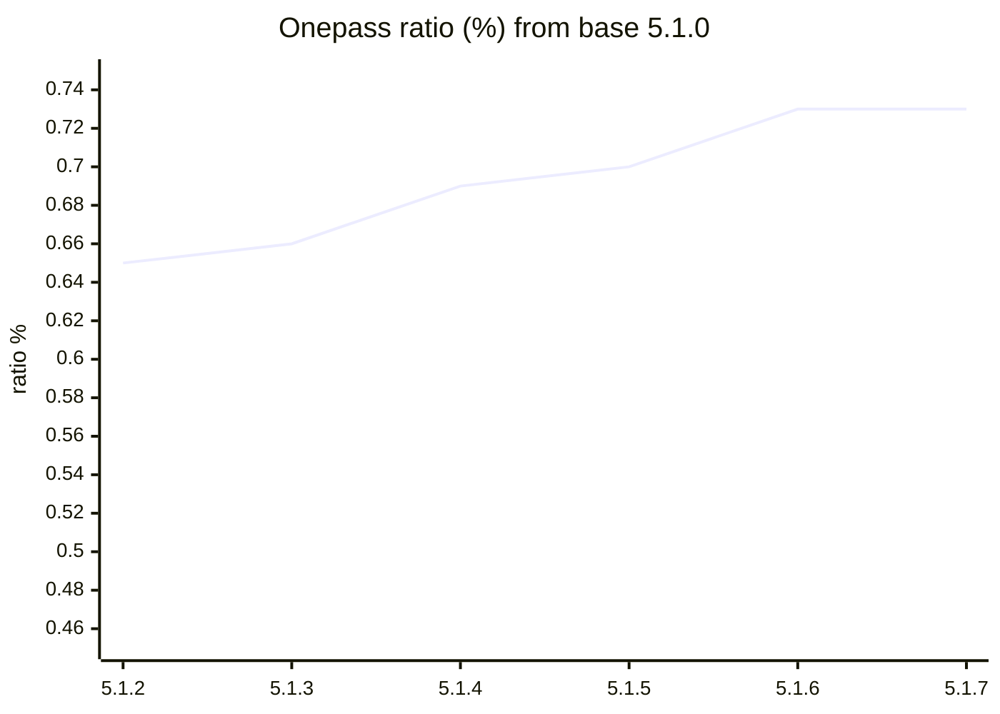
```mermaid
xychart-beta
    title "Onepass ratio (%) from base 5.1.0"
    x-axis ["5.1.2", "5.1.3", "5.1.4", "5.1.5", "5.1.6", "5.1.7"]
    y-axis "ratio %" 0.45 --> 0.75
    line [0.65, 0.66, 0.69, 0.70, 0.73, 0.73]
```

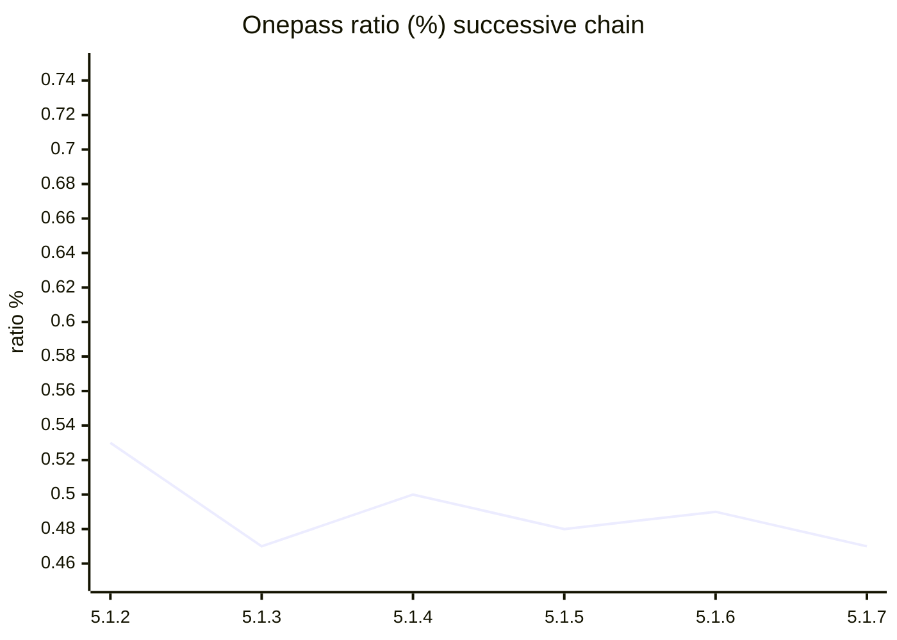
```mermaid
xychart-beta
    title "Onepass ratio (%) successive chain"
    x-axis ["5.1.2", "5.1.3", "5.1.4", "5.1.5", "5.1.6", "5.1.7"]
    y-axis "ratio %" 0.45 --> 0.75
    line [0.53, 0.47, 0.50, 0.48, 0.49, 0.47]
```

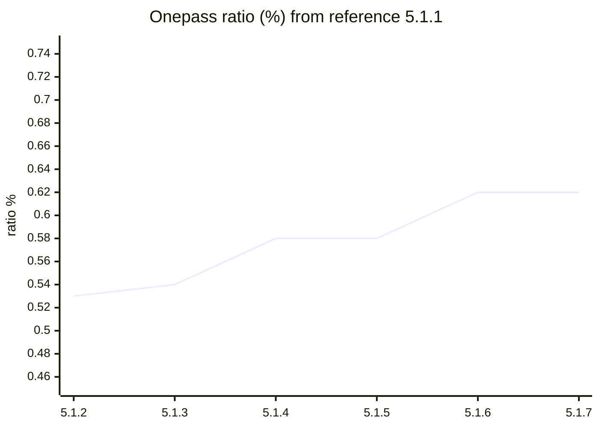
```mermaid
xychart-beta
    title "Onepass ratio (%) from reference 5.1.1"
    x-axis ["5.1.2", "5.1.3", "5.1.4", "5.1.5", "5.1.6", "5.1.7"]
    y-axis "ratio %" 0.45 --> 0.75
    line [0.53, 0.54, 0.58, 0.58, 0.62, 0.62]
```

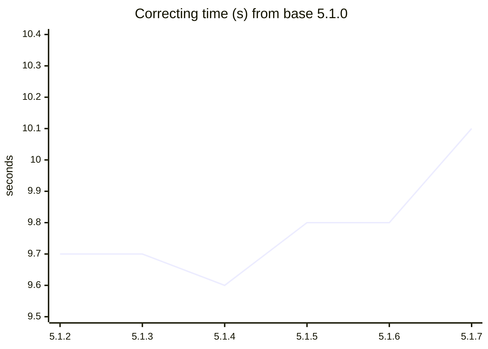
```mermaid
xychart-beta
    title "Correcting time (s) from base 5.1.0"
    x-axis ["5.1.2", "5.1.3", "5.1.4", "5.1.5", "5.1.6", "5.1.7"]
    y-axis "seconds" 9.5 --> 10.4
    line [9.7, 9.7, 9.6, 9.8, 9.8, 10.1]
```

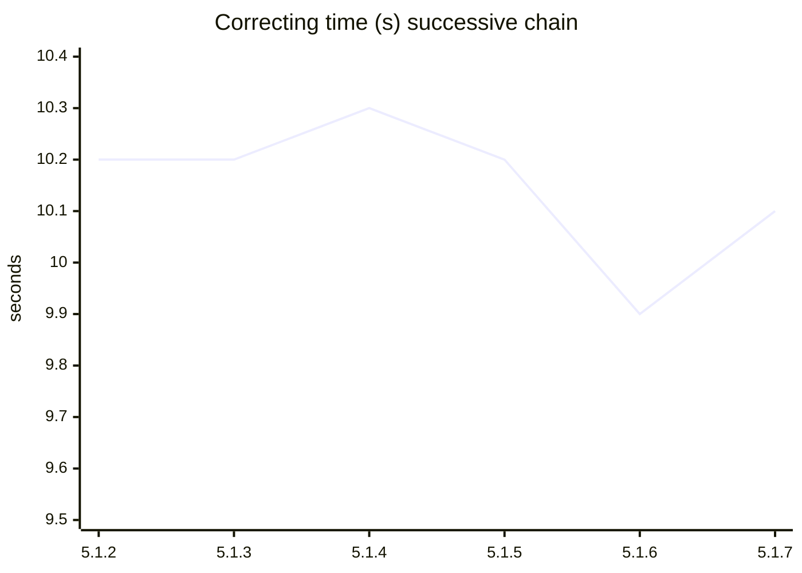
```mermaid
xychart-beta
    title "Correcting time (s) successive chain"
    x-axis ["5.1.2", "5.1.3", "5.1.4", "5.1.5", "5.1.6", "5.1.7"]
    y-axis "seconds" 9.5 --> 10.4
    line [10.2, 10.2, 10.3, 10.2, 9.9, 10.1]
```

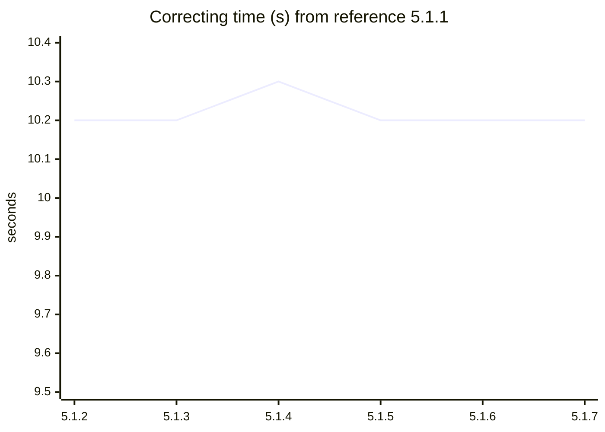
```mermaid
xychart-beta
    title "Correcting time (s) from reference 5.1.1"
    x-axis ["5.1.2", "5.1.3", "5.1.4", "5.1.5", "5.1.6", "5.1.7"]
    y-axis "seconds" 9.5 --> 10.4
    line [10.2, 10.2, 10.3, 10.2, 10.2, 10.2]
```

### Splay tree: correcting compression ratio

The correcting+splay cross-version kernel results (same six pairs, ~871 MB,
Rust):

| Ref → Ver | Ratio (hash) | Ratio (splay) | Time (hash) | Time (splay) |
|-----------|-------------:|--------------:|------------:|-------------:|
| 5.1.1 → 5.1.2 | 0.86% | 0.85% | 9s | 47s |
| 5.1.1 → 5.1.3 | 0.81% | 0.80% | 9s | 47s |
| 5.1.2 → 5.1.1 | 0.81% | 0.80% | 9s | 47s |
| 5.1.2 → 5.1.3 | 1.02% | 1.00% | 9s | 47s |
| 5.1.3 → 5.1.1 | 0.78% | 0.78% | 9s | 47s |
| 5.1.3 → 5.1.2 | 0.85% | 0.83% | 9s | 47s |

Splay wins on ratio by a small but consistent margin (~0.01–0.02 pp) on
every pair, at ~5× the wall time (~7.5× algorithm-only).

### Transposition benchmark

Synthetic test: R and V contain the same blocks in different orders.
R is written in identity order; V is written in a permuted order where
the specified percentage of blocks have been displaced from their
original positions.  Generated by `tests/gen_transpositions.py`;
run with `tests/transposition-benchmark.sh`.

**16 MB — 32,000 blocks × 512 B mean (greedy, onepass, correcting)**

| Algorithm | Perm% | Ratio | Copies | Adds | Time |
|-----------|------:|------:|-------:|-----:|-----:|
| greedy | 0% | 0.0000 | 1 | 0 | 2.502s |
| greedy | 25% | 0.0112 | 14,062 | 0 | 2.559s |
| greedy | 50% | 0.0191 | 24,064 | 0 | 2.558s |
| greedy | 75% | 0.0238 | 30,015 | 0 | 2.546s |
| greedy | 100% | 0.0254 | 31,998 | 0 | 2.582s |
| onepass | 0% | 0.0000 | 1 | 0 | 0.007s |
| onepass | 25% | 0.2580 | 6,064 | 6,063 | 0.193s |
| onepass | 50% | 0.5115 | 8,068 | 8,066 | 0.369s |
| onepass | 75% | 0.7588 | 6,026 | 6,025 | 0.517s |
| onepass | 100% | 0.9921 | 268 | 268 | 0.842s |
| correcting | 0% | 0.0000 | 1 | 0 | 0.136s |
| correcting | 25% | 0.0112 | 14,062 | 0 | 0.133s |
| correcting | 50% | 0.0191 | 24,064 | 0 | 0.145s |
| correcting | 75% | 0.0238 | 30,015 | 0 | 0.148s |
| correcting | 100% | 0.0254 | 31,998 | 0 | 0.148s |

At 16 MB with 512 B blocks (~497 seeds per block), correcting matches
greedy exactly at every permutation level: zero adds, identical copy
counts and ratios.  Each block has enough seeds that at least one
passes the checkpoint filter with overwhelming probability, so no
blocks are missed.  onepass degrades severely — by 100% permutation
its ratio is 0.9921, nearly the full file size as adds.

**1 GB — 8,000,000 blocks × 128 B mean (onepass, correcting)**

| Algorithm | Perm% | Ratio | Copies | Adds | Time |
|-----------|------:|------:|-------:|-----:|-----:|
| onepass | 0% | 0.0000 | 1 | 0 | 0.492s |
| onepass | 25% | 0.4344 | 1,910,225 | 1,910,224 | 22.189s |
| onepass | 50% | 0.6720 | 1,860,789 | 1,860,788 | 34.403s |
| onepass | 75% | 0.8066 | 1,387,053 | 1,387,052 | 41.019s |
| onepass | 100% | 0.8847 | 936,854 | 936,852 | 44.549s |
| correcting | 0% | 0.0000 | 1 | 0 | 10.133s |
| correcting | 25% | 0.0657 | 5,037,571 | 20,151 | 12.251s |
| correcting | 50% | 0.0902 | 6,884,925 | 32,702 | 13.170s |
| correcting | 75% | 0.0994 | 7,563,033 | 38,482 | 13.643s |
| correcting | 100% | 0.1027 | 7,813,315 | 40,253 | 13.897s |

At 1 GB with 128 B blocks (~113 seeds per block), correcting diverges
from greedy.  The checkpoint filter now misses a measurable fraction of
blocks — 58K–116K adds per permutation level — because with only ~7
checkpoint seeds per block (113 seeds / stride m≈16), some blocks have
no seed that passes the checkpoint test for the chosen class k.
correcting is still 6–8× better than onepass at 25–100% permutation and
runs in near-constant time (~10–13 s) regardless of permutation level,
while onepass time grows with permutation as it emits more adds.

**Inplace vs normal — 16 MB, onepass and correcting**

"Cycles" counts copy commands converted to literal adds to break CRWI
dependency cycles.

| Algorithm | Perm% | Ratio-N | Ratio-IP | Adds-N | Adds-IP | Time-N | Time-IP | Cycles |
|-----------|------:|--------:|---------:|-------:|--------:|-------:|--------:|-------:|
| onepass | 0% | 0.0000 | 0.0000 | 0 | 0 | 0.007s | 0.008s | 0 |
| onepass | 25% | 0.2580 | 0.2580 | 6,063 | 6,063 | 0.188s | 0.188s | 0 |
| onepass | 50% | 0.5115 | 0.5115 | 8,066 | 8,066 | 0.356s | 0.366s | 0 |
| onepass | 75% | 0.7588 | 0.7588 | 6,025 | 6,025 | 0.519s | 0.518s | 0 |
| onepass | 100% | 0.9921 | 0.9921 | 268 | 268 | 0.843s | 0.840s | 0 |
| correcting | 0% | 0.0000 | 0.0000 | 0 | 0 | 0.144s | 0.127s | 0 |
| correcting | 25% | 0.0112 | 0.1520 | 0 | 4,847 | 0.132s | 0.159s | 4,847 |
| correcting | 50% | 0.0191 | 0.2409 | 0 | 8,569 | 0.146s | 0.180s | 8,569 |
| correcting | 75% | 0.0238 | 0.2529 | 0 | 9,841 | 0.146s | 0.212s | 9,841 |
| correcting | 100% | 0.0254 | 0.2569 | 0 | 10,265 | 0.151s | 0.238s | 10,265 |

onepass has zero inplace overhead: it already emits adds for displaced
blocks, so the remaining copies don't create cycles in the CRWI graph.

correcting's inplace ratio is higher than standard because it encodes
all transpositions as copies in standard mode, but those copies create
CRWI cycles (copy A reads the region copy B will write; copy B reads the
region copy A will write).  "Cycles broken" counts copy-to-add
conversions: each time the topological sort stalls, the cycle finder
locates one cycle and converts the minimum-length copy to a literal add.
Because a single converted node can participate in multiple cycles, the
number of conversions may be less than the number of distinct cycles.
The count equals Adds-IP exactly, since correcting's standard output has
zero adds.  At 25% permutation 4,847 copies are converted, raising the
ratio from 0.0112 to 0.1520 (~14×).

**Apply-phase performance — 16 MB, onepass and correcting**

Decoding a standard delta and decoding an in-place delta should cost
roughly the same: both walk the command list and emit bytes.  The data
below confirms this.  For correcting, apply time is 5–7 ms at all
permutation levels and is format-transparent.  The design goal holds:
all the cost lives in CRWI construction and cycle-breaking at encode time,
done once.  Apply is essentially free.

| Algorithm | Perm% | Apply-N | Apply-IP |
|-----------|------:|--------:|---------:|
| onepass | 0% | 0.005s | 0.006s |
| onepass | 25% | 0.007s | 0.008s |
| onepass | 50% | 0.007s | 0.008s |
| onepass | 75% | 0.008s | 0.008s |
| onepass | 100% | 0.009s | 0.008s |
| correcting | 0% | 0.006s | 0.006s |
| correcting | 25% | 0.006s | 0.007s |
| correcting | 50% | 0.007s | 0.009s |
| correcting | 75% | 0.008s | 0.007s |
| correcting | 100% | 0.009s | 0.008s |

Both algorithms apply in under 10 ms at all permutation levels: all the
cost lives in CRWI construction and cycle-breaking at encode time.
onepass apply-N and apply-IP remain within 2 ms of each other at every
level.  At 100% permutation the onepass standard delta is ~15.9 MB of
literal data (ratio 0.9921), yet apply completes in under 10 ms because
the data is streamed sequentially.

**Inplace scaling — correcting, 16 → 256 MB (512 B mean blocks)**

| Size | Perm% | Ratio-N | Ratio-IP | Adds-IP | Time-N | Time-IP |
|-----:|------:|--------:|---------:|--------:|-------:|--------:|
| 16 MB | 0% | 0.0000 | 0.0000 | 0 | 0.134s | 0.137s |
| 16 MB | 25% | 0.0112 | 0.1520 | 4,847 | 0.141s | 0.159s |
| 16 MB | 50% | 0.0191 | 0.2409 | 8,569 | 0.146s | 0.181s |
| 16 MB | 75% | 0.0238 | 0.2529 | 9,841 | 0.148s | 0.213s |
| 16 MB | 100% | 0.0254 | 0.2569 | 10,265 | 0.149s | 0.234s |
| 32 MB | 0% | 0.0000 | 0.0000 | 0 | 0.284s | 0.288s |
| 32 MB | 25% | 0.0111 | 0.1584 | 10,138 | 0.297s | 0.363s |
| 32 MB | 50% | 0.0191 | 0.2413 | 17,238 | 0.307s | 0.441s |
| 32 MB | 75% | 0.0238 | 0.2491 | 19,411 | 0.313s | 0.526s |
| 32 MB | 100% | 0.0254 | 0.2573 | 20,585 | 0.317s | 0.618s |
| 64 MB | 0% | 0.0000 | 0.0000 | 0 | 0.595s | 0.596s |
| 64 MB | 25% | 0.0111 | 0.1531 | 19,274 | 0.620s | 0.830s |
| 64 MB | 50% | 0.0190 | 0.2368 | 34,053 | 0.638s | 1.015s |
| 64 MB | 75% | 0.0238 | 0.2542 | 39,652 | 0.652s | 1.408s |
| 64 MB | 100% | 0.0254 | 0.2576 | 41,191 | 0.660s | 1.554s |
| 128 MB | 0% | 0.0000 | 0.0000 | 0 | 1.214s | 1.212s |
| 128 MB | 25% | 0.0111 | 0.1576 | 39,388 | 1.263s | 2.243s |
| 128 MB | 50% | 0.0190 | 0.2421 | 69,158 | 1.304s | 2.633s |
| 128 MB | 75% | 0.0238 | 0.2555 | 79,538 | 1.329s | 3.530s |
| 128 MB | 100% | 0.0254 | 0.2582 | 82,561 | 1.340s | 4.150s |
| 256 MB | 0% | 0.0000 | 0.0000 | 0 | 2.445s | 2.452s |
| 256 MB | 25% | 0.0111 | 0.1594 | 79,232 | 2.561s | 5.015s |
| 256 MB | 50% | 0.0190 | 0.2430 | 138,716 | 2.615s | 6.280s |
| 256 MB | 75% | 0.0238 | 0.2544 | 158,392 | 2.696s | 9.486s |
| 256 MB | 100% | 0.0254 | 0.2579 | 164,877 | 2.719s | 11.765s |

The CRWI graph build is O(n log n + E): the binary-search sweep exploits
non-overlapping write intervals for exact overlap detection.
Standard-mode correcting time scales ~2× per doubling (linear in n).
Inplace time at 100% permutation scales ~2.6× per doubling
(0.234 → 0.618 → 1.554 → 4.150 → 11.765 s across 16 → 32 → 64 → 128 → 256 MB),
reflecting the O(n log n + E) total complexity of the Tarjan + global
Kahn + amortized DFS cycle-breaking algorithm.  At 256 MB with 512K
blocks and 164K conversions, the total encode time is still under 12 seconds.

### Effect of `--max-table` on correcting ratio (1 GB, 128 B blocks)

Delta ratio as a function of `--max-table` cap, across all five
permutation levels.  Each cell is the correcting ratio for that
(permutation, table size) pair.

| Max table | 0% | 25% | 50% | 75% | 100% |
|----------:|---:|----:|----:|----:|-----:|
| 1M | 0.0000 | 0.8844 | 0.9422 | 0.9550 | 0.9589 |
| 2M | 0.0000 | 0.7933 | 0.8898 | 0.9129 | 0.9198 |
| 4M | 0.0000 | 0.6596 | 0.7989 | 0.8358 | 0.8474 |
| 8M | 0.0000 | 0.4946 | 0.6569 | 0.7065 | 0.7230 |
| 16M | 0.0000 | 0.3262 | 0.4683 | 0.5188 | 0.5368 |
| 32M | 0.0000 | 0.1853 | 0.2744 | 0.3098 | 0.3230 |
| 64M | 0.0000 | 0.0988 | 0.1425 | 0.1601 | 0.1668 |
| 128M | 0.0000 | 0.0689 | 0.0954 | 0.1052 | 0.1090 |
| 256M+ | 0.0000 | 0.0689 | 0.0954 | 0.1052 | 0.1090 |

Ratios are stable at 128M entries and above — that is the natural table
size for this dataset (8M blocks of 128 B with p=16 seeds per block).
The "knee" of the curve lies around 32–64M entries; below that the ratio
climbs steeply as the checkpoint stride grows coarser and the filter
misses an increasing fraction of blocks.

At 1M entries the algorithm operates in the same regime as small-table
configurations in the original paper (Ajtai et al. 2002, Section 8):
checkpointing is so coarse that most blocks are missed and the ratio
approaches 1 for highly-permuted inputs.  A 128M-entry table uses
roughly 2 GB of RAM (~16 bytes per entry).

---

## Stylometric side analysis: Shakespeare authorship

Delta compression can be used as a stylometric probe.
If author A ghostwrote the works attributed to author B, their texts should
share long, structured runs of vocabulary, phrasing, and syntactic idiom —
exactly what the correcting algorithm is designed to find.  Short common-word
matches (median ≤ 17 bytes, i.e. "of the", "in the") are noise; long matches
(mean >> 100 bytes) are signal.

The complete works were collected from Project Gutenberg and compared with the
correcting algorithm using Shakespeare as the reference.  All corpora were
normalized before comparison: whitespace runs collapsed to a single space
(`tr -s '[:space:]'`), eliminating OCR artefacts (extra spaces,
mid-word hyphenation) that would otherwise suppress exact-match runs.
Sizes below are post-normalization.

| Corpus | Norm. size | Source |
|--------|----------:|--------|
| Shakespeare complete works | 5,379,937 B | PG #100 |
| Marlowe: 7 major works | 914,849 B | PG #779, 901, 1094, 1496, 1589, 18781, 20288 |
| Bacon: 6 major works | 2,090,019 B | PG #56463, 5500, 45988, 2434, 3290, 46964 |
| Mary Sidney: Psalms 44–150 + Discourse + Antonius | 420,964 B | IA + PG #21789 |
| de Vere: ~24 poems | 73,957 B | Internet Archive, Looney ed. 1921 |

### Results (correcting algorithm, Shakespeare as reference, all corpora normalized)

| Candidate | Norm. size | Ratio | Coverage | Copies | Mean copy |
|-----------|----------:|------:|---------:|-------:|----------:|
| Marlowe | 915 KB | 86.1% | 17.4% | 1,460 | 108.8 B |
| Mary Sidney | 421 KB | 95.8% | 5.4% | 218 | 103.9 B |
| Bacon | 2.09 MB | 95.1% | 7.7% | 2,627 | 60.9 B |
| de Vere | 74 KB | 97.8% | 5.6% | 114 | 36.1 B |

None achieves meaningful compression.  Successive Linux kernel point releases,
which genuinely share 99%+ of their content, compress to 0.5–1.0%; all
Shakespeare-vs-candidate ratios lie above 86%, indicating almost no shared
structure beyond common Elizabethan English.

**Marlowe** leads by every metric: highest coverage (17.4%), most copies
(1,460), lowest ratio (86.1%).  Shared genre (blank verse drama) produces
the best result, but 83% of his text still requires raw adds.  Shared genre
is not shared authorship.

**Mary Sidney** has the second-longest mean copy (103.9 B), reflecting shared
classical sources (Petrarch, Garnier, Mornay) that Shakespeare also drew on.
Her corpus is the second-smallest (~421 KB) and half of it is OCR-derived.

**Bacon** has the largest corpus (2.09 MB) yet the weakest signal per byte:
shortest mean copy (60.9 B), coverage barely above de Vere's.  Natural
philosophy and moral essays share only function-word sequences with blank
verse drama.

**de Vere** is last among evaluable candidates.  Coverage is 5.6% and mean
copy length is only 36.1 B — just above the 16-byte detection floor,
indistinguishable from common Elizabethan function phrases.  His
authenticated corpus (~24 poems) is the smallest; the Oxfordian theory is
essentially unfalsifiable by this method.

Result summary: this experiment does not provide compression evidence for
non-Shakespearean authorship.

### Burrows' Delta cross-check

Delta compression measures literal byte-level reuse.  Stylometrics asks a
different question: do the authors use the same function words in the same
proportions, unconsciously?  Burrows' Delta (Argamon 2008 z-score formulation)
is the standard tool.  It was run on the same whitespace-normalized corpora
using `tests/burrows-delta.py` (stdlib-only Python, no external dependencies).

Algorithm: top-N most frequent words across all corpora combined; per-corpus
relative frequency (per 1000 words); z-scores using population std; linear
Delta(A,B) = mean |z_A(w) − z_B(w)|.  Lower = more similar.  Values < 1.0
are "close" in the literature; > 1.5 are "distant."

Corpus word counts (post-normalization):

| Corpus | Words |
|--------|------:|
| Shakespeare | 983,072 |
| Marlowe | 158,862 |
| Bacon | 355,406 |
| Mary Sidney | 74,677 |
| de Vere | 13,476 |

Linear Delta from Shakespeare (N = 50 / 100 / 200 / 500 most frequent words):

| Candidate | N=50 | N=100 | N=200 | N=500 | Rank |
|-----------|-----:|------:|------:|------:|-----:|
| Marlowe | **0.780** | **0.908** | **0.998** | **1.028** | 1 |
| de Vere | 1.037 | 1.244 | 1.272 | 1.291 | 2 |
| Mary Sidney | 1.310 | 1.411 | 1.467 | 1.416 | 3 |
| Bacon | 1.902 | 1.760 | 1.678 | 1.622 | 4 |

Rankings are completely stable across all N values.

**Marlowe** is the only candidate below 1.0 at N=50 — genuinely "close"
by stylometric standards.  Shared genre (blank verse drama) drives both
this result and the delta-compression result; the function-word distributions
of Elizabethan dramatic dialogue are tightly clustered regardless of author.

**de Vere** ranks second here, which appears to contradict the delta-
compression result (where he ranked last).  The discrepancy is a corpus-size
artefact: z-score normalization partially corrects for size, but 13,476 words
is too few for stable frequency estimates — 73 of the top-500 words have zero
frequency in de Vere, contributing legitimate but noisy z-scores.  The rank-2
result should be treated with caution.

**Mary Sidney** ranks third by both methods.  Her function-word profile is
closer to Shakespeare's than Bacon's across all N.

**Bacon** is last by a large margin in both analyses.  His linear Delta
(1.62–1.90) places him firmly in the "distant" zone.  Natural-philosophy
prose and moral essays use function words in fundamentally different
proportions from dramatic blank verse; no authorship theory survives either
metric.

Both methods agree on what matters: Marlowe closest, Bacon furthest, and no
candidate close enough to be consistent with shared authorship.

---

## References

- M. Ajtai, R. Burns, R. Fagin, D.D.E. Long, and L. Stockmeyer.
  Compactly encoding unstructured inputs with differential compression.
  *Journal of the ACM*, 49(3):318-367, May 2002.

- R.C. Burns, D.D.E. Long, and L. Stockmeyer.
  In-place reconstruction of version differences.
  *IEEE Transactions on Knowledge and Data Engineering*, 15(4):973-984,
  Jul/Aug 2003.

- A.B. Kahn.
  Topological sorting of large networks.
  *Communications of the ACM*, 5(11):558-562, November 1962.

- R.E. Tarjan.
  Depth-first search and linear graph algorithms.
  *SIAM Journal on Computing*, 1(2):146-160, June 1972.

- R.M. Karp and M.O. Rabin.
  Efficient randomized pattern-matching algorithms.
  *IBM Journal of Research and Development*, 31(2):249-260, March 1987.

- V.I. Levenshtein.
  Binary codes capable of correcting deletions, insertions, and reversals.
  *Soviet Physics Doklady*, 10(8):707-710, 1966.

- W. Miller and E.W. Myers.
  A file comparison program.
  *Software — Practice and Experience*, 15(11):1025-1040, 1985.

- M.O. Rabin.
  Probabilistic algorithm for testing primality.
  *Journal of Number Theory*, 12(1):128-138, February 1980.

- D.D. Sleator and R.E. Tarjan.
  Self-adjusting binary search trees.
  *Journal of the ACM*, 32(3):652-686, July 1985.

- A. Reichenberger.
  Delta storage for arbitrary non-text files.
  *Proceedings of the 3rd International Workshop on Software Configuration
  Management*, pages 144-152, 1991.

- W.F. Tichy.
  The string-to-string correction problem with block moves.
  *ACM Transactions on Computer Systems*, 2(4):309-321, November 1984.

- R.A. Wagner and M.J. Fischer.
  The string-to-string correction problem.
  *Journal of the ACM*, 21(1):168-173, January 1974.

- J. Burrows.
  Delta: A measure of stylistic difference and a guide to likely authorship.
  *Literary and Linguistic Computing*, 17(3):267-287, 2002.

- S. Argamon.
  Interpreting Burrows's Delta: Geometric and probabilistic foundations.
  *Literary and Linguistic Computing*, 23(2):131-147, 2008.
