# ANALYSIS — Algorithms, Design Decisions, and Performance

Explains why the implementation is structured as it is: the algorithmic
background, key design choices, and measured performance data.

## Relationship to edit distance and common substrings

Differential compression emerged as an application of the
string-to-string correction problem (Wagner and Fischer 1974), which
asks for the minimum-cost sequence of edits transforming one string into
another.  Levenshtein distance (Levenshtein 1966) is the simplest
instance: single-character insertions, deletions, and substitutions,
computed by $O(mn)$ dynamic programming.

Early differencing algorithms solved string-to-string correction by
computing the longest common subsequence (LCS) of strings R and V, then
treating all characters outside the LCS as data to be added explicitly
(Ajtai et al. 2002, Section 1.1).  This formulation assumes a one-to-one
correspondence between matching substrings and requires that they appear
in the same order in both strings.  Tichy (1984) generalized to the
"string-to-string correction problem with block move," which permits
variable-length substrings to be copied multiple times and out of
sequence.  Traditional algorithms for this problem — the greedy
algorithm of Reichenberger (1991) and the dynamic programming approach
of Miller and Myers (1985) — run in $O(mn)$ or $O(n^2)$ time.

The algorithms implemented here (Ajtai et al. 2002) solve the
string-to-string correction problem with block move using Karp-Rabin
fingerprinting (Karp and Rabin 1987) to discover variable-length common
substrings between R and V in linear time.  A single substring in R may
be copied to multiple locations in V, and matches need not preserve
order.  With a hash table of fixed size, the onepass and correcting
algorithms run in $O(n)$ time and $O(1)$ space — compared to $O(mn)$ for
edit-distance dynamic programming.  (The implementations here grow the
table with the reference by default; see below.)  For
a 1 MB file with a 1 KB change, Levenshtein requires $\sim 10^{12}$ operations;
onepass finds the change in a single linear scan.

## Checkpointing (correcting algorithm)

The correcting algorithm uses checkpointing (Ajtai et al. 2002,
Section 8) to select which seeds enter the hash table.

Two parameters govern the hash table:

- **$|C|$** = auto-sized table capacity (`next_prime(min(max_table,
  max(table_size, 2 * num_seeds / p)))`).  Each entry is 16 bytes
  (fingerprint + position, 8 bytes each).  `--table-size` sets the floor
  and `--max-table` the ceiling.
- **$|F|$** $\approx 2|R|$ (auto-computed): the footprint modulus.  Set to
  `next_prime(2 * num_seeds)` for good distribution.

The checkpoint stride is $m = \lceil |F|/|C| \rceil$.  A seed is a **checkpoint
seed** if its footprint $f = \text{fingerprint} \bmod |F|$ satisfies $f \equiv k
\pmod{m}$ (Section 8.1, Eq. 3), where $k$ is the class of a seed of V.
The paper takes a random seed of V, which favors the classes that occur
most often in V (p. 348); the code takes the seed in the middle of V, so
the output does not depend on a random choice.  Only checkpoint seeds are stored in or
looked up from the hash table; all others are skipped.  This gives at
most $\approx |C|/2$ occupied slots (~50% load factor) regardless of $|R|$ (Section 8.1,
p. 347: $L \cdot |C|/|F| \approx |C|/2$, hence $|F| \approx 2L$); fewer
when seeds repeat, since a fingerprint is stored once.  A checkpoint seed's
home slot is $\lfloor f/m \rfloor$; seeds with different fingerprints and
the same home slot are resolved by linear probing, and of seeds with the
same fingerprint the first in R is kept.

The checkpoint stride `m` equals the average spacing between checkpoint
seeds.  Matching substrings shorter than ~m bytes may be missed because
none of their seeds pass the checkpoint test.  A longer match has more
seeds and so is more likely, though not certain, to contain a checkpoint;
when it does, backward extension (Section 5.1) discovers the true start
of the match even when it falls between checkpoint positions (Section
8.2, p. 349).

With auto-sizing, $m \approx p$ (the seed length), so checkpoint granularity
roughly matches seed granularity.  When the reference is small enough
that $|F| \leq |C|$, the stride is $m=1$ and every seed is a checkpoint —
equivalent to direct indexing with no filtering overhead.

The footprint modulus $|F|$ is chosen as a prime using a deterministic
Miller-Rabin primality test with the fixed witness set {2, 3, 5, 7, 11,
13, 17, 19, 23, 29, 31, 37}.  This set is proven sufficient for all n <
318,665,857,834,031,151,167,461 ($> 2^{78}$), far exceeding any table
size that arises in practice (Sorenson and Webster, Math. Comp. 86(304),
2017).
No random number generator is required: the result is deterministic and
identical across all six language implementations.

## Splay tree: design and tradeoffs

The splay tree option (`--splay`) replaces the hash table with a
Tarjan-Sleator self-adjusting binary search tree (Sleator and Tarjan 1985).
Every access splays the accessed node to the root via zig/zig-zig/zig-zag
rotations, giving amortized $O(\log n)$ per operation.

**Onepass:** onepass inserts a seed from R and then looks it up shortly
after when it scans the corresponding V region.  The splay tree exploits
this temporal locality in principle, but $O(\log n)$ rotations per access
outweigh the locality benefit in practice: on the 871 MB kernel tarballs
the differencing takes 0.85 s with the splay tree and 0.52 s with the
hash table, as the tool reports them.  The command as a whole takes 1.9 s
against 1.6 s, the checksums and I/O being the same for both.

**Why it hurts for correcting:** correcting's R pass inserts millions
of checkpoint seeds in random order before any V lookups begin.  The
build phase has no locality benefit, and $O(\log n)$ per insertion is
slower than $O(1)$ hash table insertion.  Lookups during the V pass also
lack the recent-access advantage.  On the kernel tarballs, correcting
with the splay tree takes 38 s of differencing against 6.1 s, 6.2× as
long.

**The delta is the same.**  The correcting hash table is keyed by the
whole fingerprint and resolves collisions of home slots by linear
probing, so, like the splay tree, it holds the first seed of R for every
checkpoint fingerprint, unless it fills.  On every input tried the two
produce byte-identical correcting deltas (the seven kernel pairs below
among them).  The onepass table is direct-mapped, and a fingerprint that
finds its slot taken is not recorded, where the splay tree records it;
onepass deltas can therefore differ by a few bytes either way, though on
the kernel pair they are identical.

**Practical access cost:** the $O(\log n)$ characterization is a worst-case
amortized bound.  A fingerprint appearing $k$ times in R is splayed to the
root $k$ times during the build phase, so the most common fingerprints are
near the root by the time the V scan begins.  For a Zipfian frequency
distribution — which natural language and source code both follow closely
— the weighted average access cost is $O(\log H)$ where $H$ is the entropy of
the distribution, substantially less than $O(\log n)$.

## Binary delta format specification

This section is the normative wire format definition.  All six
implementations must conform exactly; any deviation is a bug.

There are two magics.  The tools write `DLT\x04`.  `DLT\x03`, its
predecessor, is still read, and the libraries can still write it.

### Header

`DLT\x04` (29 bytes):

```
Offset  Size  Field          Encoding
------  ----  -----          --------
0       4     magic          bytes 0x44 0x4C 0x54 0x04  ("DLT\x04")
4       1     flags          u8 bitmask:
                               bit 0 = INPLACE (0x01)
                               bits 1–7 reserved, must be 0 on write,
                               ignored on read
5       8     version_size   u64 big-endian — byte length of the
                               reconstructed version file
13      8     src_crc        CRC-64/XZ of the reference file, big-endian
21      8     dst_crc        CRC-64/XZ of the version file, big-endian
```

`DLT\x03` (25 bytes) is the same with magic byte 0x03 and a u32
`version_size`, so that `src_crc` is at offset 9 and `dst_crc` at 17.

### Command stream (immediately follows header)

Commands are emitted in order and terminated by an END record.
All multi-byte integers are **big-endian**.

| Type | Name | Fields | Size |
|-----:|------|--------|-----:|
| 0x00 | END | none | 1 |
| 0x01 | COPY | `src` u32, `dst` u32, `length` u32 | 13 |
| 0x02 | ADD | `dst` u32, `length` u32, `length` bytes of data | 9 + length |
| 0x03 | BIGCOPY | `src` u64, `dst` u64, `length` u64 | 25 |
| 0x04 | BIGADD | `dst` u64, `length` u64, `length` bytes of data | 17 + length |
| 0x05 | MOVE | `src` u32, `dst` u32, `length` u32 | 13 |
| 0x06 | BIGMOVE | `src` u64, `dst` u64, `length` u64 | 25 |

- **COPY, BIGCOPY** copy `length` bytes from offset `src` of the reference
  to offset `dst` of the output.  Constraint: `src + length ≤
  len(reference)`, `dst + length ≤ version_size`.
- **ADD, BIGADD** write the literal bytes that follow at offset `dst`.
  Constraint: `dst + length ≤ version_size`.
- **MOVE, BIGMOVE** copy `length` bytes of the output already written,
  from offset `src` to offset `dst`.  Constraint: `src + length ≤ dst`,
  `dst + length ≤ version_size`.
- **END** must appear exactly once, as the last record.  Decoders must
  reject files that lack an END record or contain bytes after it.

`DLT\x03` has only END, COPY and ADD; a decoder must reject the other
four types in a `DLT\x03` file.

An encoder writing `DLT\x04` gives each copy and add the 32-bit form
when all of its fields fit in 32 bits and the BIG form otherwise.  The
`--large` flag forces the BIG forms, for testing.  The encoders here do
not produce MOVE or BIGMOVE; the decoders accept them.

### In-place vs standard format

The INPLACE flag (bit 0 of `flags`) indicates that the delta is applied
in the buffer that holds the reference: a copy's `src` and `dst` are both
offsets in that buffer, and `src` ranges may overlap `dst` ranges.
Commands are ordered so that they can be applied one after another
without a separate output buffer.  The flag does not change the encoding
of any command; only the semantics of application differ.

### Sizes

A copy costs 13 bytes and an add 9 bytes plus its data whenever the
offsets and lengths are below 4 GiB, so for such files `DLT\x04` costs
four bytes more than `DLT\x03` did, all in the header.  For the kernel
tarball delta of about 200,000 copies, writing every copy in the BIG
form would add about 2.4 MB.

**Truncated files:** A decoder that reaches the end of the byte stream
before encountering an END record must return an error.  Partial
records (insufficient bytes remaining for the declared field
widths) must also be rejected.

### Version history

| Magic | Change |
|-------|--------|
| `DLT\x01` | Original format (no integrity hashes) |
| `DLT\x02` | Added 16-byte SHAKE-128 src/dst hashes (header: 41 bytes) |
| `DLT\x03` | Replaced SHAKE-128 with 8-byte CRC-64/XZ (header: 25 bytes); still read |
| `DLT\x04` | u64 `version_size` (header: 29 bytes); BIGCOPY, BIGADD, MOVE, BIGMOVE — current |

Decoders must reject files with unknown magic bytes; `DLT\x01` and
`DLT\x02` are no longer read.

## Delta integrity verification

Every delta file embeds two 8-byte CRC-64/XZ checksums in its header:
`src_crc` (CRC of the reference file) and `dst_crc` (CRC of the
reconstructed version).  Decode performs two checks:

- **Pre-check** (before reconstruction): `crc64_xz(ref) == src_crc`.
  Catches wrong-reference errors immediately, before any computation.
- **Post-check** (after reconstruction): `crc64_xz(output) == dst_crc`.
  Catches corruption in the delta file itself or any bug in the apply
  phase.

CRC-64/XZ (ECMA-182 reflected, polynomial `0x42F0E1EBA9EA3693`)
was chosen for speed and a small digest.  The
8-byte output gives a $2^{-64}$ probability of an undetected random error,
sufficient for accidental-error detection in delta workflows.  All six
implementations compute the same function (reflected polynomial
`0xC96C5795D7870F42`, init = xorout = `0xFFFFFFFFFFFFFFFF`), verified
against the standard check value `crc64_xz(b"123456789") =
0x995DC9BBDF1939FA`.  C, C++, Rust and Java use eight tables and take
eight bytes at a step (slicing-by-8); Go uses the standard library's
`hash/crc64`; Python uses one table and takes a byte at a step.

The `--ignore-hash` decode flag replaces both error exits with stderr
warnings and continues, providing an escape hatch for partial recovery
from a corrupted or mismatched delta.  The library itself does not
enforce the checks; CRC validation is the caller's responsibility.

## In-place conversion: CRWI graph and cycle breaking

In-place reconstruction writes the version V directly into the buffer
holding the reference R, without a separate output buffer.  This requires
that a copy command reading from R[src..src+len] execute before any copy
command that overwrites that region.

### The CRWI digraph

The dependency relation is captured by the Copy-Read/Write-Intersection
(CRWI) digraph (Burns, Long, and Stockmeyer 2003): edge i → j means
copy i reads a region that copy j will write, so i must execute before j.
If this graph is acyclic, a topological sort gives a safe execution order.
If it contains a cycle, the commands in the cycle cannot all be copies —
at least one must be converted to a literal add (materializing the source
data before it is overwritten).

The CRWI graph is built in $O(n \log n + E)$: copies are sorted by write
start, and for each copy's read interval a binary search finds the exact
range of overlapping writes in $O(\log n)$, exploiting the fact that write
intervals are non-overlapping (each output byte is written exactly once).

### Cycle breaking: Kahn + Tarjan + depth-first search

A naïve approach — remove vertices one-by-one until the graph is acyclic
— can convert far more copies than necessary if it ignores the global
structure.  The algorithm combines three ideas:

1. **Global Kahn topological sort** processes all zero-in-degree copies
   first, in order of increasing length, ties broken by index, so that
   the order is deterministic.  When a copy is processed, its out-edges
   are removed and successors whose in-degree drops to zero are added to
   the queue.  This preserves the **cascade effect**: converting one copy
   to an add decrements in-degrees across the whole graph, potentially
   freeing other copies at no further cost.

2. **Tarjan SCC decomposition** identifies the strongly connected
   components of the CRWI graph, the first time the sort stalls.  A cycle
   lies within a component of more than one vertex, so only those are
   searched.

3. **Depth-first search within one component** finds a cycle when the
   sort stalls: every copy that remains is waiting on another, so a cycle
   remains.  Under `localmin` the shortest copy on the cycle found is
   converted to an add; under `constant` the lowest-numbered copy that
   remains is converted without a search.

   The search colors a vertex as on the current path or as done, meaning
   that no cycle passes through it.  Removing vertices cannot create a
   cycle, so a vertex once done is never searched again, and the scan for
   a starting vertex resumes where it stopped.  When a cycle is found,
   the vertices on the path are uncolored and are walked again by the
   next search, so the searches are not linear in total: many cycles at
   the end of one long path cost the path's length each.  Burns et al.
   give $O(|V|^2)$ as the worst case for the local-minimum policy.

### Why per-SCC local Kahn is wrong

An earlier approach used Tarjan SCC plus a *local* Kahn sort within each
SCC, computing in-degrees only among within-SCC edges.  This loses the
**global cascade effect**: when a victim is converted, the global in-degree
decrement can free copies in other SCCs at no additional conversion cost.
Local Kahn misses this, producing 56% more conversions (16,048 vs 10,265
at 16 MB 100% permutation) and significantly worse compression ratios
(0.4036 vs 0.2569).

### Complexity

CRWI graph build: $O(n \log n + E)$.
Kahn's sort: $O(n \log n + E)$, the logarithm from its heap.  Tarjan:
$O(n + E)$.
Cycle searches under `localmin`: $O(n + E)$ plus the length of the search
path for each cycle broken; none under `constant`.

---

## Test scripts

| Script | Purpose |
|--------|---------|
| `tests/correctness.sh` | Builds all six implementations and runs unit tests + cross-language compatibility |
| `tests/kernel-delta-test.sh` | Performance benchmark on Linux 5.1.0–5.1.7 kernel tarballs (~871 MB each) |
| `tests/transposition-benchmark.sh` | Performance benchmark on synthetic block permutations (16 MB–1 GB) |
| `tests/per-language-benchmark.sh` | Per-language speed comparison (compiled implementations, linux-5.1.0→5.1.1) |
| `tests/get_shakespeare.sh` | Download Shakespeare (PG #100) and generate mutated versions for bench_all.sh |
| `tests/bench_rust.sh` | Rust micro-benchmarks via pilot-bench (1 MiB synthetic data, MiB/s with CI) |
| `tests/bench_all.sh` | Compiled languages via pilot-bench (Shakespeare ~5.4 MB, 5% mutations, MiB/s with CI) |

`tests/correctness.sh` is the primary correctness gate: it runs all unit
suites and verifies cross-language byte-identical compatibility.  The
benchmark scripts are separate so they can be run independently without
the multi-GB data requirements of the kernel tests.  For statistically
rigorous CI, use `bench_rust.sh` or `bench_all.sh` (require pilot-bench;
see [BENCHMARKING.md](BENCHMARKING.md)).

## Performance benchmarks

### Kernel tarball benchmark (linux-5.1 → linux-5.1.1, 871 MB)

Compiled implementations, same input pair, default flags, one run each with
`tests/per-language-benchmark.sh` on 2026-10-03, code at `efa83c6`, the
tarballs on each machine's internal SSD and in its page cache. All ten
runs of each algorithm produced byte-identical delta files. The machines
were as described for the Pilot tables below; the output is in
[bench/2026-10-03-three-machines](bench/2026-10-03-three-machines/README.md).

**onepass** (delta: 5,075,535 bytes, 0.58% of the version)

| Language | M4 Pro (dyson) | i5-8259U (dmz) |
|----------|---------------:|---------------:|
| C        | 1.4s | 2.6s |
| Go       | 1.5s | 3.5s |
| C++      | 1.6s | 3.1s |
| Java     | 1.8s | 5.4s |
| Rust     | 2.0s | 3.5s |

**correcting** (delta: 6,948,688 bytes, 0.80% of the version)

| Language | M4 Pro (dyson) | i5-8259U (dmz) |
|----------|---------------:|---------------:|
| Rust     | 7.1s | 20.0s |
| Java     | 7.5s | 29.3s |
| C++      | 8.3s | 21.0s |
| Go       | 11.9s | 27.1s |
| C        | 12.4s | 24.4s |

At this size the onepass differencing itself is under a second (the C
encoder reports 0.93 s on a comparable machine), and much of the command is
the CRC-64 of the two 871 MB inputs. All five compiled implementations now
compute it eight bytes at a time: Go with the standard library's
`hash/crc64`, the other four by slicing-by-8 (`efa83c6`). Before that
change the four used a byte-at-a-time table and Go led onepass by a factor
of 1.6 to 2.7; the change took 1.9 to 3.3 s off each of their onepass and
correcting times on both machines and left Go's where they were, so on
onepass the five are now within 0.6 s of one another on the M4 Pro. On
correcting the differencing dominates: Rust, Java and C++ are within 17%
on the M4 Pro, with Go and C well behind.  About three quarters of C's
deficit there is function calls: correcting rolls the fingerprint once
for each of the 871 million bytes of R, and the C rolling hash is in
another source file, compiled without link-time optimization, so each
roll is three calls that the Rust and C++ compilers inline.  Built with
`-flto`, the C implementation took 8.6 s against 13.1 s without, in the
same session in which Rust took 7.1 to 7.5 s.
These are single-run measurements; use `bench_all.sh` for statistically
rigorous CI. Radar views below are committed SVG charts generated by
`assets/generate_analysis_radars.py` using the same underlying data
(time-based plots are converted to normalized speed scores where faster=larger).

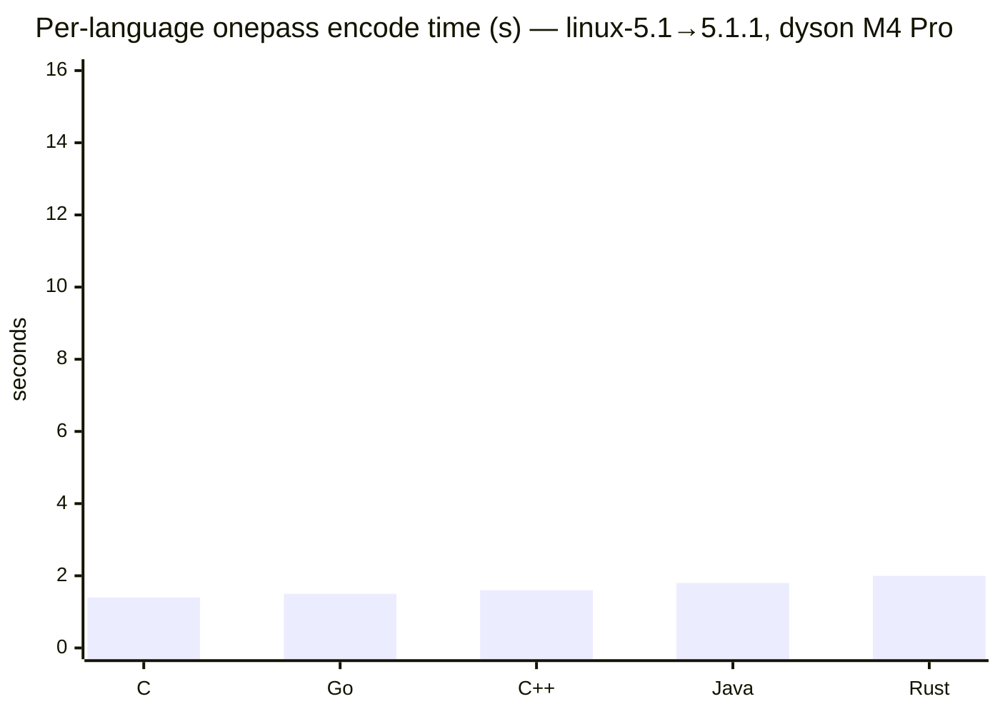

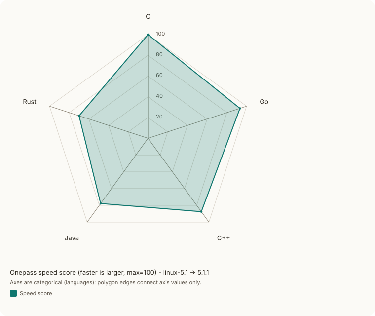

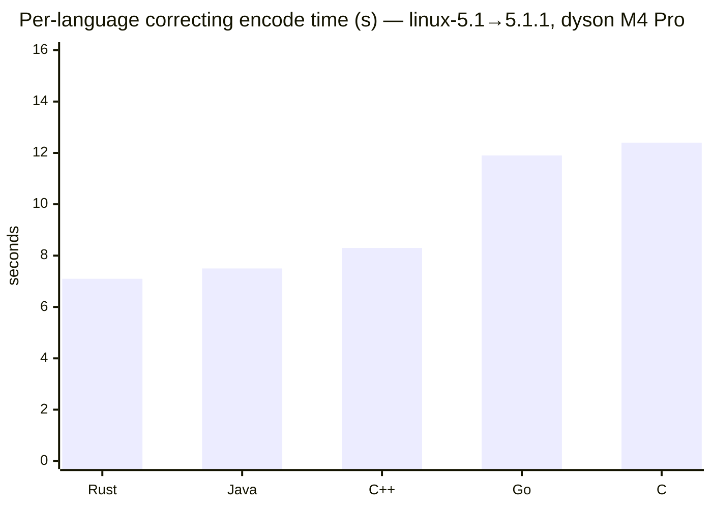

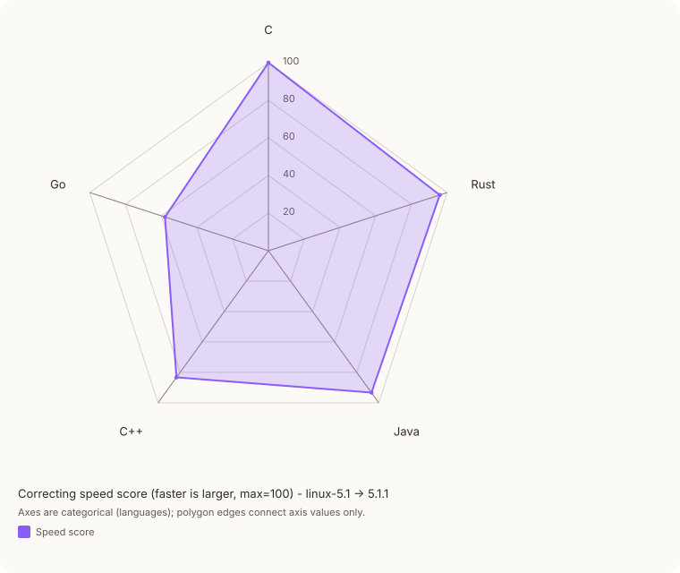

### Throughput with confidence intervals (pilot-bench, Shakespeare)

Shakespeare's complete works (~5.4 MB ref, 5% byte mutations as version),
measured with `tests/bench_all.sh` (pilot-bench, `quick` preset, 95%
confidence). Metric: MiB/s (reference file size ÷ elapsed encode time,
including process start-up). The mean is the harmonic mean, the total work
over the total time; the CI width is the full width of the 95% confidence
interval, found from the reciprocals of the readings, and is not symmetric
about the mean.

All three columns were measured on 2026-10-03 with Pilot `a6e6e77` and the
code at `efa83c6`, the same input files on each machine. On baase Rust, C
and C++ ran pinned to one Cortex-X925 core and Java and Go to the ten
Cortex-X925 cores; on dmz, to CPU 2 and to all eight; dyson is not
pinned. dmz was idle. baase had its resident vLLM/Ray service, serving
nothing, on about a fifth of a core. dyson was a desktop in use, 22 minutes
after a reboot, with a load average near 3: thirteen of its fifteen
sessions needed more than the minimum 30 rounds to reach the interval. Raw
output, toolchains and the script are in
[bench/2026-10-03-three-machines](bench/2026-10-03-three-machines/README.md).

**onepass**

| Language | M4 Pro (dyson) | CI width | i5-8259U (dmz) | CI width | Cortex-X925 (baase) | CI width |
|----------|----------:|----------:|----------:|----------:|----------:|----------:|
| Rust | 62.26 | 0.492 | 17.72 | 0.2318 | 36.9 | 0.4707 |
| Go | 61.02 | 0.6875 | 13.55 | 0.1892 | 28.21 | 1.313 |
| C | 50.58 | 0.4266 | 17 | 0.1499 | 28.48 | 0.1084 |
| C++ | 47.15 | 0.2857 | 18.92 | 0.0765 | 34.41 | 0.07044 |
| Java | 28.97 | 0.8608 | 10.31 | 0.05386 | 20.81 | 0.5876 |

**correcting**

| Language | M4 Pro (dyson) | CI width | i5-8259U (dmz) | CI width | Cortex-X925 (baase) | CI width |
|----------|----------:|----------:|----------:|----------:|----------:|----------:|
| Rust | 69.29 | 1.158 | 17.87 | 0.8503 | 42.04 | 0.1022 |
| C++ | 56.49 | 0.554 | 16.12 | 0.7516 | 41.73 | 0.1392 |
| Go | 41.4 | 0.2857 | 13.53 | 0.1437 | 30.97 | 0.8782 |
| C | 39.41 | 0.4556 | 14.81 | 0.4983 | 43.42 | 0.06544 |
| Java | 29.18 | 0.6957 | 9.217 | 0.08701 | 23.49 | 0.8465 |

No implementation leads everywhere. Rust leads correcting on dyson and dmz
and onepass on dyson and baase, with Go 2% behind it on the M4 Pro; C++
leads onepass on the i5-8259U; on the Cortex-X925, C leads correcting with
Rust and C++ within 4%. Java is last everywhere.
The i5-8259U runs the native implementations at between a fifth and two
fifths of the M4 Pro's rates, and Java at about a third.
On the small Shakespeare workload the ranking shifts from the 871 MB kernel
tarball, where the checksums and I/O of a 1.7 GB pair weigh on every
implementation alike.

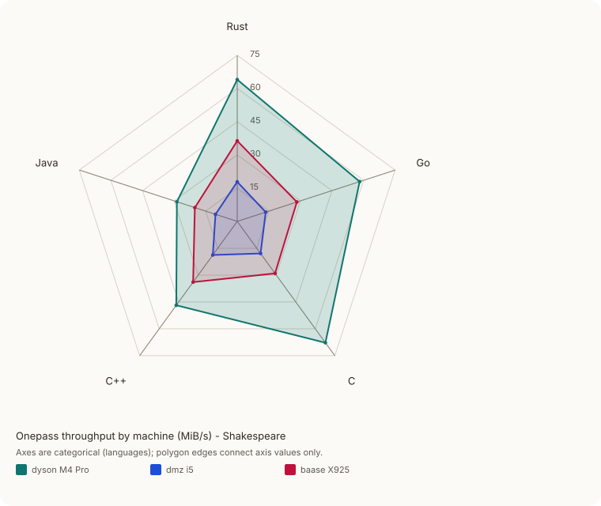

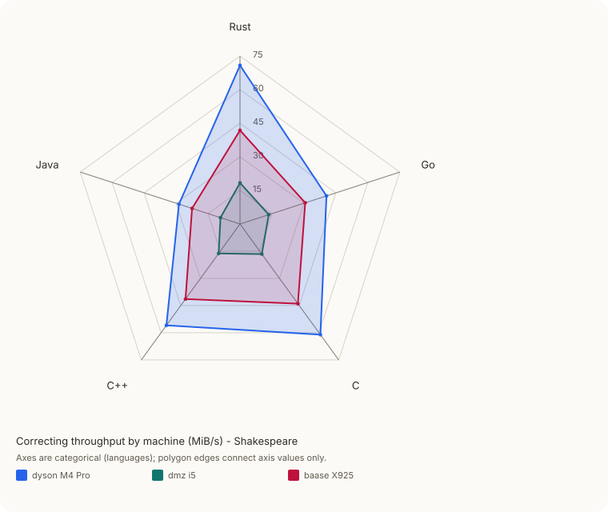

The charts below are the M4 Pro alone.

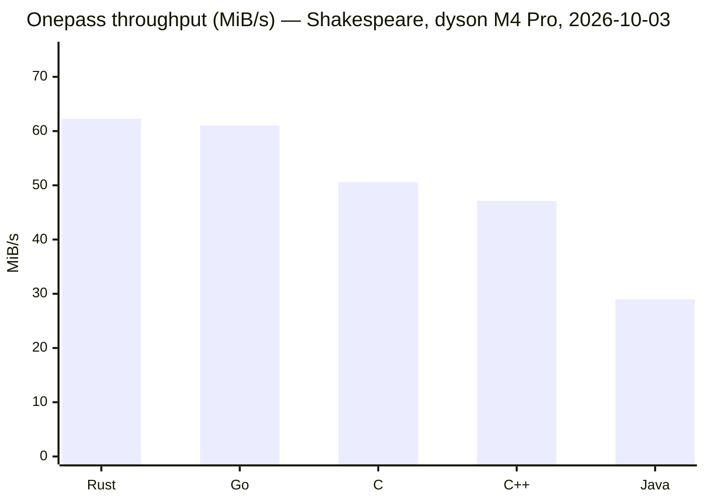

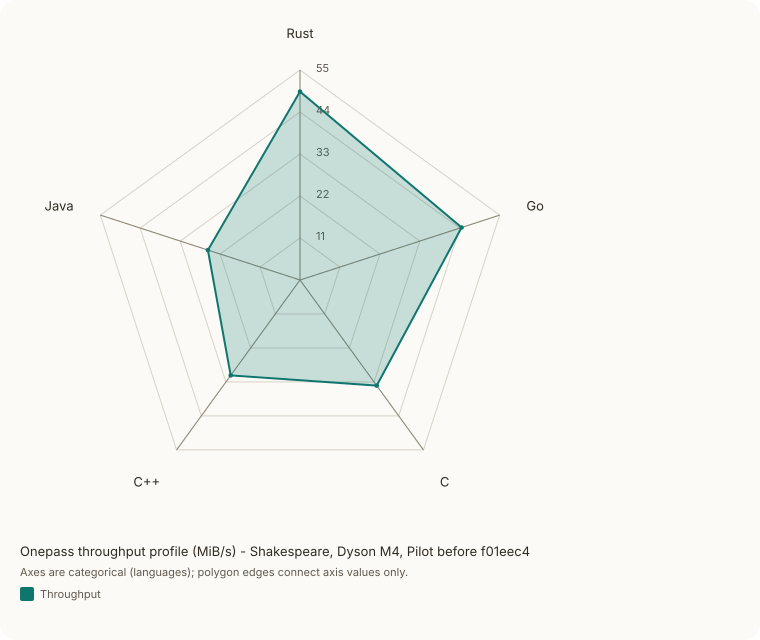

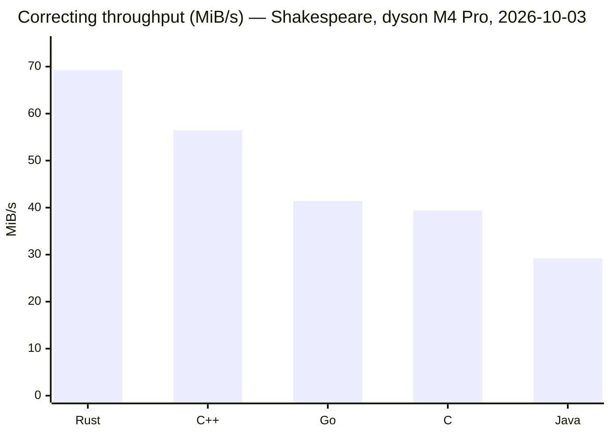

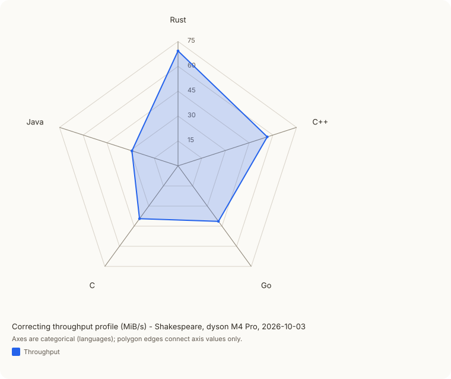

### Multi-machine comparison

| Machine | CPU | RAM | Storage |
|---------|-----|-----|---------|
| dyson (local) | Apple M4 Pro | 64 GB | Internal NVMe SSD |
| dmz | Intel Core i5-8259U @ 2.30 GHz | 32 GB | Internal SSD / `/archive` HDD |
| baase | NVIDIA GB10, Arm Cortex-X925 @ 3.9 GHz (10 of its 20 cores) | 128 GB | Internal NVMe SSD |

#### Rust micro-benchmarks (bench_rust.sh, 1 MiB in-memory, MiB/s)

Operations use 1 MiB of LCG-generated data with ~5% single-byte mutations.
No disk I/O — results are pure CPU performance.

| Operation | M4 Pro (dyson) | CI width | i5-8259U (dmz) | CI width | Cortex-X925 (baase) | CI width |
|-----------|----------:|----------:|----------:|----------:|----------:|----------:|
| encode_greedy_1m | 12.42 | 0.1797 | 3.033 | 0.02725 | 3.13 | 0.007135 |
| encode_onepass_1m | 73.17 | 0.9886 | 14.7 | 0.3438 | 29.68 | 0.02522 |
| encode_correcting_1m | 37.14 | 1.795 | 14.5 | 0.03339 | 25.62 | 0.05426 |
| decode_1m | 1051 | 15.07 | 608.8 | 50.82 | 1630 | 3.335 |
| inplace_1m | 529.1 | 6.177 | 224.7 | 2.137 | 371.6 | 1.587 |

Measured with the three columns above, 2026-10-03, Pilot `a6e6e77`,
code at `efa83c6`, one core on the Linux machines. The i5-8259U is 4–5×
slower than the M4 Pro on greedy and onepass and 2.6× on correcting. The
Cortex-X925 is 1.55× the M4 Pro on decode and below it on every encode:
0.25× on greedy, 0.41× on onepass, 0.69× on correcting and 0.70× on
inplace. The intervals are under 2.5% of the mean except dyson on
correcting at 5% and dmz on decode at 8%; on baase they are under 0.5%.

---

**Rust, default vs `--splay`** (linux-5.1 → 5.1.1, dyson, 2026-10-03)

| Algorithm | Flags | Time | Differencing | Delta | Copies | Median copy |
|-----------|-------|-----:|-------------:|------:|-------:|------------:|
| onepass | (default) | 1.6s | 0.52s | 4.8 MB | 205,030 | 89 B |
| onepass | `--splay` | 1.9s | 0.85s | 4.8 MB | 205,030 | 89 B |
| correcting | (default) | 7.2s | 6.1s | 6.6 MB | 243,756 | 91 B |
| correcting | `--splay` | 39.1s | 38.1s | 6.6 MB | 243,756 | 91 B |

Time is the whole command; Differencing is what the tool reports for the
algorithm alone.  The copy-length distribution is heavy-tailed: median is 89–91 bytes
(barely above the 16-byte seed length), but the mean is 3,600–4,200
bytes and the maximum reaches 14 MB.  Most copies are short, but most
*bytes* come from long copies.

### Integrity-check overhead

Every encode and decode call computes two CRC-64/XZ checksums: one over
the reference file (`src_crc`, pre-checked before reconstruction) and
one over the version or output file (`dst_crc`, verified after).  The C
slicing-by-8 routine runs at 2.0 GB/s on the M4 Pro, so checksumming an
871 MB kernel tarball takes 0.43 s and the pair 0.86 s: about half of a
onepass encode of the kernel pair (1.4 to 2.0 s) and about a tenth of a
correcting one.

### Cross-version kernel benchmark (linux-5.1.x, C++)

All six ordered pairs of linux-5.1.1, 5.1.2, and 5.1.3 (~871 MB each),
encoded with the C++ implementation (default flags), one run each on
dyson (M4 Pro), 2026-10-03:

| Ref → Ver | onepass Ratio | onepass Time | correcting Ratio | correcting Time |
|-----------|-------------:|------------:|-----------------:|----------------:|
| 5.1.1 → 5.1.2 | 0.54% | 1.6s | 0.85% | 8.5s |
| 5.1.1 → 5.1.3 | 0.55% | 1.7s | 0.80% | 8.5s |
| 5.1.2 → 5.1.1 | 0.53% | 1.7s | 0.80% | 8.5s |
| 5.1.2 → 5.1.3 | 0.47% | 1.6s | 1.00% | 8.6s |
| 5.1.3 → 5.1.1 | 0.54% | 1.7s | 0.78% | 8.7s |
| 5.1.3 → 5.1.2 | 0.47% | 1.6s | 0.83% | 8.5s |

Onepass is about 5× faster than correcting and achieves better ratios on
every pair.  Correcting times are nearly uniform (~8.5s) because encoding
is dominated by the build phase over the 871 MB reference.

### Extended kernel benchmark (linux-5.1.0–5.1.7, Rust)

Three reference modes run with `tests/kernel-delta-test.sh` (Rust, default
flags), one run each on dyson (M4 Pro), 2026-10-03.  All tarballs are
~871 MB post-gunzip.  The script truncates a ratio to two places where the
tables above round it, so 0.797% is 0.79% here and 0.80% there.

**From base: 5.1.0 → 5.1.{1..7}** — fixed reference, cumulative divergence

| Version | onepass ratio | onepass time | correcting ratio | correcting time |
|---------|-------------:|------------:|-----------------:|----------------:|
| 5.1.1 | 0.58% | 1.5s | 0.79% | 7.2s |
| 5.1.2 | 0.65% | 1.6s | 1.00% | 7.3s |
| 5.1.3 | 0.66% | 1.6s | 1.02% | 7.4s |
| 5.1.4 | 0.69% | 1.6s | 1.04% | 7.4s |
| 5.1.5 | 0.70% | 1.6s | 0.85% | 7.4s |
| 5.1.6 | 0.73% | 1.6s | 0.99% | 7.3s |
| 5.1.7 | 0.73% | 1.6s | 0.87% | 7.2s |

Onepass ratios climb steadily as versions accumulate changes from the fixed
5.1.0 base.  Correcting ratios fluctuate: each version's checkpoint bias k
(derived from the midpoint fingerprint of V) varies, affecting how many
seeds survive the checkpoint filter and hence how many matches are found.

**Successive / chain: 5.1.n → 5.1.n+1** — each version against its predecessor

| Transition | onepass ratio | onepass time | correcting ratio | correcting time |
|------------|-------------:|------------:|-----------------:|----------------:|
| 5.1.0→5.1.1 | 0.58% | 1.5s | 0.79% | 7.3s |
| 5.1.1→5.1.2 | 0.53% | 1.6s | 0.84% | 7.3s |
| 5.1.2→5.1.3 | 0.47% | 1.5s | 0.99% | 7.3s |
| 5.1.3→5.1.4 | 0.50% | 1.5s | 0.81% | 7.5s |
| 5.1.4→5.1.5 | 0.48% | 1.5s | 0.78% | 7.3s |
| 5.1.5→5.1.6 | 0.49% | 1.5s | 0.77% | 7.4s |
| 5.1.6→5.1.7 | 0.47% | 1.5s | 0.84% | 7.6s |

Successive onepass deltas (0.47–0.58%) are consistently smaller than
from-base deltas to the same version (0.58–0.73%): each adjacent pair of
kernel releases shares more content than either does with 5.1.0.  Correcting
ratios stay in a similar range either way, showing the algorithm is less
sensitive to reference choice when the checkpoint filter is tuned to the
reference size.

**From 5.1.1: 5.1.1 → 5.1.{2..7}** — fixed non-zero reference, growing divergence

| Version | onepass ratio | onepass time | correcting ratio | correcting time |
|---------|-------------:|------------:|-----------------:|----------------:|
| 5.1.2 | 0.53% | 1.6s | 0.84% | 7.3s |
| 5.1.3 | 0.54% | 1.6s | 0.80% | 7.6s |
| 5.1.4 | 0.58% | 1.6s | 0.95% | 7.4s |
| 5.1.5 | 0.58% | 1.6s | 0.81% | 7.4s |
| 5.1.6 | 0.62% | 1.6s | 0.85% | 7.3s |
| 5.1.7 | 0.62% | 1.6s | 0.81% | 7.3s |

Using 5.1.1 as reference, onepass ratios grow gradually from 0.53% to 0.62%
as versions diverge further — slower growth than from base 5.1.0, since 5.1.1
is inherently closer to all later versions.  The 5.1.1→5.1.2 successive delta
(0.53%) equals the 5.1.1→5.1.2 from-5.1.1 delta by definition; from there
the from-5.1.1 ratios grow while successive ratios stay flat (0.47–0.50%).

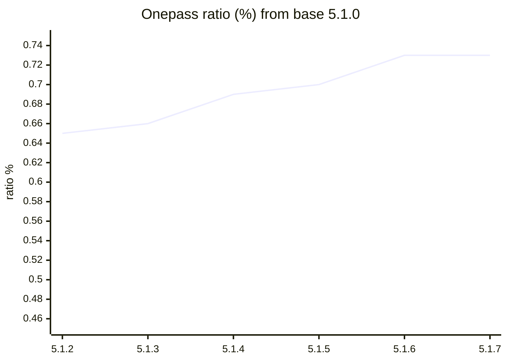

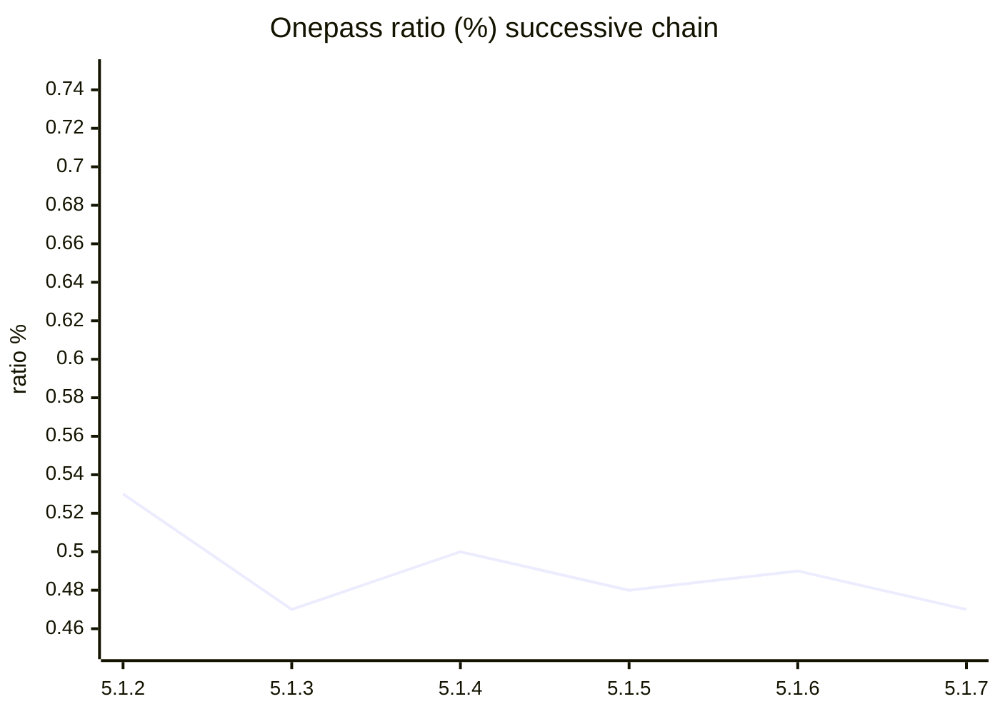

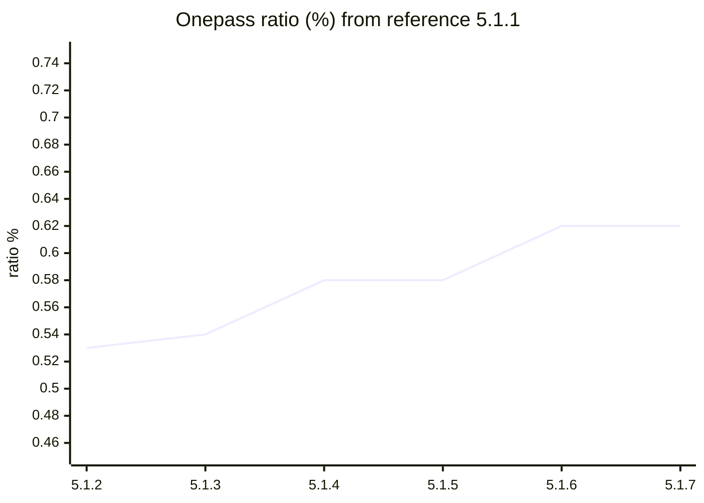

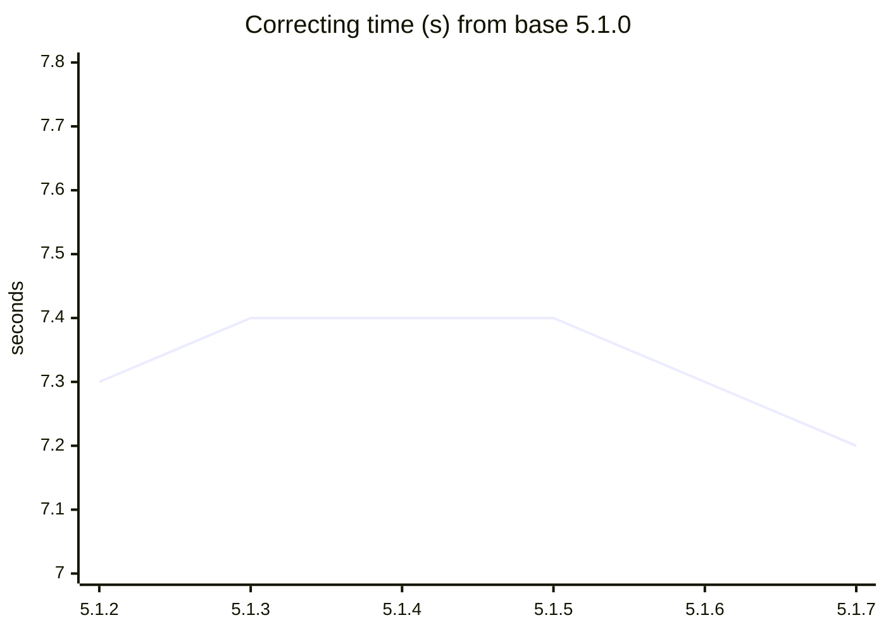

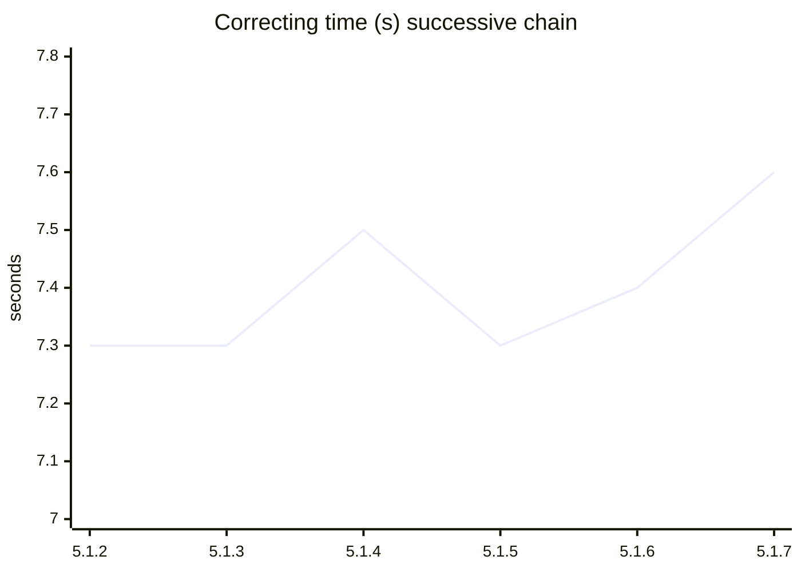

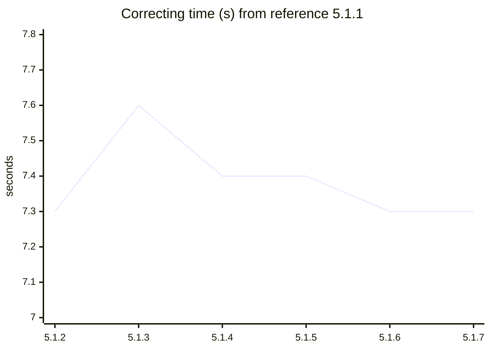

### Splay tree: correcting on the cross-version pairs

The same six pairs (~871 MB, Rust, dyson, 2026-10-03), correcting with
the hash table and with `--splay`:

| Ref → Ver | Ratio (hash) | Ratio (splay) | Time (hash) | Time (splay) |
|-----------|-------------:|--------------:|------------:|-------------:|
| 5.1.1 → 5.1.2 | 0.85% | 0.85% | 7.3s | 42.6s |
| 5.1.1 → 5.1.3 | 0.80% | 0.80% | 7.5s | 43.7s |
| 5.1.2 → 5.1.1 | 0.80% | 0.80% | 7.5s | 43.4s |
| 5.1.2 → 5.1.3 | 1.00% | 1.00% | 7.5s | 43.9s |
| 5.1.3 → 5.1.1 | 0.78% | 0.78% | 7.5s | 44.1s |
| 5.1.3 → 5.1.2 | 0.83% | 0.83% | 7.5s | 41.5s |

The two delta files are byte-identical for every pair, and the splay tree
takes nearly six times as long.

### Transposition benchmark

Synthetic test: R and V contain the same blocks in different orders.
R is written in identity order; V is written in a permuted order where
the specified percentage of blocks have been displaced from their
original positions.  Generated by `tests/gen_transpositions.py`;
run with `tests/transposition-benchmark.sh`.

**16 MB — 32,000 blocks × 512 B mean (greedy, onepass, correcting)**

| Algorithm | Perm% | Ratio | Copies | Adds | Time |
|-----------|------:|------:|-------:|-----:|-----:|
| greedy | 0% | 0.0000 | 1 | 0 | 2.502s |
| greedy | 25% | 0.0112 | 14,062 | 0 | 2.559s |
| greedy | 50% | 0.0191 | 24,064 | 0 | 2.558s |
| greedy | 75% | 0.0238 | 30,015 | 0 | 2.546s |
| greedy | 100% | 0.0254 | 31,998 | 0 | 2.582s |
| onepass | 0% | 0.0000 | 1 | 0 | 0.007s |
| onepass | 25% | 0.2580 | 6,064 | 6,063 | 0.193s |
| onepass | 50% | 0.5115 | 8,068 | 8,066 | 0.369s |
| onepass | 75% | 0.7588 | 6,026 | 6,025 | 0.517s |
| onepass | 100% | 0.9921 | 268 | 268 | 0.842s |
| correcting | 0% | 0.0000 | 1 | 0 | 0.136s |
| correcting | 25% | 0.0112 | 14,062 | 0 | 0.133s |
| correcting | 50% | 0.0191 | 24,064 | 0 | 0.145s |
| correcting | 75% | 0.0238 | 30,015 | 0 | 0.148s |
| correcting | 100% | 0.0254 | 31,998 | 0 | 0.148s |

At 16 MB with 512 B blocks (~497 seeds per block), correcting matches
greedy exactly at every permutation level: zero adds, identical copy
counts and ratios.  Each block has enough seeds that at least one
passes the checkpoint filter with overwhelming probability, so no
blocks are missed.  onepass degrades severely — by 100% permutation
its ratio is 0.9921, nearly the full file size as adds.

**1 GB — 8,000,000 blocks × 128 B mean (onepass, correcting)**

| Algorithm | Perm% | Ratio | Copies | Adds | Time |
|-----------|------:|------:|-------:|-----:|-----:|
| onepass | 0% | 0.0000 | 1 | 0 | 0.492s |
| onepass | 25% | 0.4344 | 1,910,225 | 1,910,224 | 22.189s |
| onepass | 50% | 0.6720 | 1,860,789 | 1,860,788 | 34.403s |
| onepass | 75% | 0.8066 | 1,387,053 | 1,387,052 | 41.019s |
| onepass | 100% | 0.8847 | 936,854 | 936,852 | 44.549s |
| correcting | 0% | 0.0000 | 1 | 0 | 10.133s |
| correcting | 25% | 0.0657 | 5,037,571 | 20,151 | 12.251s |
| correcting | 50% | 0.0902 | 6,884,925 | 32,702 | 13.170s |
| correcting | 75% | 0.0994 | 7,563,033 | 38,482 | 13.643s |
| correcting | 100% | 0.1027 | 7,813,315 | 40,253 | 13.897s |

At 1 GB with 128 B blocks (~113 seeds per block), correcting no longer
encodes everything as copies.  The checkpoint filter now misses a
measurable fraction of blocks — 20K–40K adds per permutation level —
because with only ~7
checkpoint seeds per block (113 seeds / stride m≈16), some blocks have
no seed that passes the checkpoint test for the chosen class k.
At this size the levels are nominal: above 5,000,000 blocks
`gen_transpositions.py` permutes by random swaps, which displace about
39%, 63%, 78% and 86% of the blocks at the 25%, 50%, 75% and 100%
settings, and it takes the reference from the system's random source, so
another run gives slightly different counts.
correcting is still 6.6–8.6× better than onepass at 25–100% permutation and
runs in near-constant time (~10–13 s) regardless of permutation level,
while onepass time grows with permutation as it emits more adds.

**Inplace vs normal — 16 MB, onepass and correcting**

"Cycles" counts copy commands converted to literal adds to break CRWI
dependency cycles.

| Algorithm | Perm% | Ratio-N | Ratio-IP | Adds-N | Adds-IP | Time-N | Time-IP | Cycles |
|-----------|------:|--------:|---------:|-------:|--------:|-------:|--------:|-------:|
| onepass | 0% | 0.0000 | 0.0000 | 0 | 0 | 0.007s | 0.008s | 0 |
| onepass | 25% | 0.2580 | 0.2580 | 6,063 | 6,063 | 0.188s | 0.188s | 0 |
| onepass | 50% | 0.5115 | 0.5115 | 8,066 | 8,066 | 0.356s | 0.366s | 0 |
| onepass | 75% | 0.7588 | 0.7588 | 6,025 | 6,025 | 0.519s | 0.518s | 0 |
| onepass | 100% | 0.9921 | 0.9921 | 268 | 268 | 0.843s | 0.840s | 0 |
| correcting | 0% | 0.0000 | 0.0000 | 0 | 0 | 0.144s | 0.127s | 0 |
| correcting | 25% | 0.0112 | 0.1520 | 0 | 4,847 | 0.132s | 0.159s | 4,847 |
| correcting | 50% | 0.0191 | 0.2409 | 0 | 8,569 | 0.146s | 0.180s | 8,569 |
| correcting | 75% | 0.0238 | 0.2529 | 0 | 9,841 | 0.146s | 0.212s | 9,841 |
| correcting | 100% | 0.0254 | 0.2569 | 0 | 10,265 | 0.151s | 0.238s | 10,265 |

onepass has zero inplace overhead: it already emits adds for displaced
blocks, so the remaining copies don't create cycles in the CRWI graph.

correcting's inplace ratio is higher than standard because it encodes
all transpositions as copies in standard mode, but those copies create
CRWI cycles (copy A reads the region copy B will write; copy B reads the
region copy A will write).  "Cycles broken" counts copy-to-add
conversions: each time the topological sort stalls, the cycle finder
locates one cycle and converts the minimum-length copy to a literal add.
Because a single converted node can participate in multiple cycles, the
number of conversions may be less than the number of distinct cycles.
The count equals Adds-IP exactly, since correcting's standard output has
zero adds.  At 25% permutation 4,847 copies are converted, raising the
ratio from 0.0112 to 0.1520 (~14×).

**Apply-phase performance — 16 MB, onepass and correcting**

Decoding a standard delta and decoding an in-place delta should cost
roughly the same: both walk the command list and emit bytes.  The data
below confirms this.  For correcting, apply time is 5–7 ms at all
permutation levels and is format-transparent.  The design goal holds:
all the cost lives in CRWI construction and cycle-breaking at encode time,
done once.  Apply is essentially free.

| Algorithm | Perm% | Apply-N | Apply-IP |
|-----------|------:|--------:|---------:|
| onepass | 0% | 0.005s | 0.006s |
| onepass | 25% | 0.007s | 0.008s |
| onepass | 50% | 0.007s | 0.008s |
| onepass | 75% | 0.008s | 0.008s |
| onepass | 100% | 0.009s | 0.008s |
| correcting | 0% | 0.006s | 0.006s |
| correcting | 25% | 0.006s | 0.007s |
| correcting | 50% | 0.007s | 0.009s |
| correcting | 75% | 0.008s | 0.007s |
| correcting | 100% | 0.009s | 0.008s |

Both algorithms apply in under 10 ms at all permutation levels: all the
cost lives in CRWI construction and cycle-breaking at encode time.
onepass apply-N and apply-IP remain within 2 ms of each other at every
level.  At 100% permutation the onepass standard delta is ~15.9 MB of
literal data (ratio 0.9921), yet apply completes in under 10 ms because
the data is streamed sequentially.

**Inplace scaling — correcting, 16 → 256 MB (512 B mean blocks)**

| Size | Perm% | Ratio-N | Ratio-IP | Adds-IP | Time-N | Time-IP |
|-----:|------:|--------:|---------:|--------:|-------:|--------:|
| 16 MB | 0% | 0.0000 | 0.0000 | 0 | 0.134s | 0.137s |
| 16 MB | 25% | 0.0112 | 0.1520 | 4,847 | 0.141s | 0.159s |
| 16 MB | 50% | 0.0191 | 0.2409 | 8,569 | 0.146s | 0.181s |
| 16 MB | 75% | 0.0238 | 0.2529 | 9,841 | 0.148s | 0.213s |
| 16 MB | 100% | 0.0254 | 0.2569 | 10,265 | 0.149s | 0.234s |
| 32 MB | 0% | 0.0000 | 0.0000 | 0 | 0.284s | 0.288s |
| 32 MB | 25% | 0.0111 | 0.1584 | 10,138 | 0.297s | 0.363s |
| 32 MB | 50% | 0.0191 | 0.2413 | 17,238 | 0.307s | 0.441s |
| 32 MB | 75% | 0.0238 | 0.2491 | 19,411 | 0.313s | 0.526s |
| 32 MB | 100% | 0.0254 | 0.2573 | 20,585 | 0.317s | 0.618s |
| 64 MB | 0% | 0.0000 | 0.0000 | 0 | 0.595s | 0.596s |
| 64 MB | 25% | 0.0111 | 0.1531 | 19,274 | 0.620s | 0.830s |
| 64 MB | 50% | 0.0190 | 0.2368 | 34,053 | 0.638s | 1.015s |
| 64 MB | 75% | 0.0238 | 0.2542 | 39,652 | 0.652s | 1.408s |
| 64 MB | 100% | 0.0254 | 0.2576 | 41,191 | 0.660s | 1.554s |
| 128 MB | 0% | 0.0000 | 0.0000 | 0 | 1.214s | 1.212s |
| 128 MB | 25% | 0.0111 | 0.1576 | 39,388 | 1.263s | 2.243s |
| 128 MB | 50% | 0.0190 | 0.2421 | 69,158 | 1.304s | 2.633s |
| 128 MB | 75% | 0.0238 | 0.2555 | 79,538 | 1.329s | 3.530s |
| 128 MB | 100% | 0.0254 | 0.2582 | 82,561 | 1.340s | 4.150s |
| 256 MB | 0% | 0.0000 | 0.0000 | 0 | 2.445s | 2.452s |
| 256 MB | 25% | 0.0111 | 0.1594 | 79,232 | 2.561s | 5.015s |
| 256 MB | 50% | 0.0190 | 0.2430 | 138,716 | 2.615s | 6.280s |
| 256 MB | 75% | 0.0238 | 0.2544 | 158,392 | 2.696s | 9.486s |
| 256 MB | 100% | 0.0254 | 0.2579 | 164,877 | 2.719s | 11.765s |

The CRWI graph build is $O(n \log n + E)$: the binary-search sweep exploits
non-overlapping write intervals for exact overlap detection.
Standard-mode correcting time scales ~2× per doubling (linear in n).
Inplace time at 100% permutation scales ~2.6× per doubling
(0.234 → 0.618 → 1.554 → 4.150 → 11.765 s across 16 → 32 → 64 → 128 → 256 MB),
more than the $O(n \log n + E)$ of the graph build and the sort alone:
the cycle searches account for the rest.  At 256 MB with 512K
blocks and 164K conversions, the total encode time is still under 12 seconds.

### Effect of `--max-table` on correcting ratio (1 GB, 128 B blocks)

Delta ratio as a function of `--max-table` cap, across all five
permutation levels.  Each cell is the correcting ratio for that
(permutation, table size) pair.

| Max table | 0% | 25% | 50% | 75% | 100% |
|----------:|---:|----:|----:|----:|-----:|
| 1M | 0.0000 | 0.8844 | 0.9422 | 0.9550 | 0.9589 |
| 2M | 0.0000 | 0.7933 | 0.8898 | 0.9129 | 0.9198 |
| 4M | 0.0000 | 0.6596 | 0.7989 | 0.8358 | 0.8474 |
| 8M | 0.0000 | 0.4946 | 0.6569 | 0.7065 | 0.7230 |
| 16M | 0.0000 | 0.3262 | 0.4683 | 0.5188 | 0.5368 |
| 32M | 0.0000 | 0.1853 | 0.2744 | 0.3098 | 0.3230 |
| 64M | 0.0000 | 0.0988 | 0.1425 | 0.1601 | 0.1668 |
| 128M | 0.0000 | 0.0689 | 0.0954 | 0.1052 | 0.1090 |
| 256M+ | 0.0000 | 0.0689 | 0.0954 | 0.1052 | 0.1090 |

Ratios are stable at 128M entries and above — that is the natural table
size for this dataset (8M blocks of 128 B with p=16 seeds per block).
The "knee" of the curve lies around 32–64M entries; below that the ratio
climbs steeply as the checkpoint stride grows coarser and the filter
misses an increasing fraction of blocks.

At 1M entries the algorithm operates in the same regime as small-table
configurations in the original paper (Ajtai et al. 2002, Section 8):
checkpointing is so coarse that most blocks are missed and the ratio
approaches 1 for highly-permuted inputs.  A 128M-entry table uses
roughly 2 GB of RAM (~16 bytes per entry).

---

## Stylometric side analysis: Shakespeare authorship

Delta compression can be used as a stylometric probe.
If author A ghostwrote the works attributed to author B, their texts should
share long, structured runs of vocabulary, phrasing, and syntactic idiom —
exactly what the correcting algorithm is designed to find.  Short common-word
matches (median ≤ 17 bytes, i.e. "of the", "in the") are noise; long matches
(mean >> 100 bytes) are signal.

The complete works were collected from Project Gutenberg and compared with the
correcting algorithm using Shakespeare as the reference.  All corpora were
normalized before comparison: whitespace runs collapsed to a single space
(`tr -s '[:space:]'`), eliminating OCR artefacts (extra spaces,
mid-word hyphenation) that would otherwise suppress exact-match runs.
Sizes below are post-normalization.

| Corpus | Norm. size | Source |
|--------|----------:|--------|
| Shakespeare complete works | 5,379,937 B | PG #100 |
| Marlowe: 7 major works | 914,849 B | PG #779, 901, 1094, 1496, 1589, 18781, 20288 |
| Bacon: 6 major works | 2,090,019 B | PG #56463, 5500, 45988, 2434, 3290, 46964 |
| Mary Sidney: Psalms 44–150 + Discourse + Antonius | 420,964 B | IA + PG #21789 |
| de Vere: ~24 poems | 73,957 B | Internet Archive, Looney ed. 1921 |

### Results (correcting algorithm, Shakespeare as reference, all corpora normalized)

| Candidate | Norm. size | Ratio | Coverage | Copies | Mean copy |
|-----------|----------:|------:|---------:|-------:|----------:|
| Marlowe | 915 KB | 86.1% | 17.4% | 1,460 | 108.8 B |
| Mary Sidney | 421 KB | 95.8% | 5.4% | 218 | 103.9 B |
| Bacon | 2.09 MB | 95.1% | 7.7% | 2,627 | 60.9 B |
| de Vere | 74 KB | 97.8% | 5.6% | 114 | 36.1 B |

None achieves meaningful compression.  Successive Linux kernel point releases,
which genuinely share 99%+ of their content, compress to 0.5–1.0%; all
Shakespeare-vs-candidate ratios lie above 86%, indicating almost no shared
structure beyond common Elizabethan English.

**Marlowe** leads by every metric: highest coverage (17.4%), most copies
(1,460), lowest ratio (86.1%).  Shared genre (blank verse drama) produces
the best result, but 83% of his text still requires raw adds.  Shared genre
is not shared authorship.

**Mary Sidney** has the second-longest mean copy (103.9 B), reflecting shared
classical sources (Petrarch, Garnier, Mornay) that Shakespeare also drew on.
Her corpus is the second-smallest (~421 KB) and half of it is OCR-derived.

**Bacon** has the largest corpus (2.09 MB) yet the weakest signal per byte:
shortest mean copy (60.9 B), coverage barely above de Vere's.  Natural
philosophy and moral essays share only function-word sequences with blank
verse drama.

**de Vere** is last among evaluable candidates.  Coverage is 5.6% and mean
copy length is only 36.1 B — just above the 16-byte detection floor,
indistinguishable from common Elizabethan function phrases.  His
authenticated corpus (~24 poems) is the smallest; the Oxfordian theory is
essentially unfalsifiable by this method.

Result summary: this experiment does not provide compression evidence for
non-Shakespearean authorship.

### Burrows' Delta cross-check

Delta compression measures literal byte-level reuse.  Stylometrics asks a
different question: do the authors use the same function words in the same
proportions, unconsciously?  Burrows' Delta (Argamon 2008 z-score formulation)
is the standard tool.  It was run on the same whitespace-normalized corpora
using `tests/burrows-delta.py` (stdlib-only Python, no external dependencies).

Algorithm: top-N most frequent words across all corpora combined; per-corpus
relative frequency (per 1000 words); z-scores using population std; linear
Delta(A,B) = mean |z_A(w) − z_B(w)|.  Lower = more similar.  Values < 1.0
are "close" in the literature; > 1.5 are "distant."

Corpus word counts (post-normalization):

| Corpus | Words |
|--------|------:|
| Shakespeare | 983,072 |
| Marlowe | 158,862 |
| Bacon | 355,406 |
| Mary Sidney | 74,677 |
| de Vere | 13,476 |

Linear Delta from Shakespeare (N = 50 / 100 / 200 / 500 most frequent words):

| Candidate | N=50 | N=100 | N=200 | N=500 | Rank |
|-----------|-----:|------:|------:|------:|-----:|
| Marlowe | **0.780** | **0.908** | **0.998** | **1.028** | 1 |
| de Vere | 1.037 | 1.244 | 1.272 | 1.291 | 2 |
| Mary Sidney | 1.310 | 1.411 | 1.467 | 1.416 | 3 |
| Bacon | 1.902 | 1.760 | 1.678 | 1.622 | 4 |

Rankings are completely stable across all N values.

**Marlowe** is the only candidate below 1.0 at N=50 — genuinely "close"
by stylometric standards.  Shared genre (blank verse drama) drives both
this result and the delta-compression result; the function-word distributions
of Elizabethan dramatic dialogue are tightly clustered regardless of author.

**de Vere** ranks second here, which appears to contradict the delta-
compression result (where he ranked last).  The discrepancy is a corpus-size
artefact: z-score normalization partially corrects for size, but 13,476 words
is too few for stable frequency estimates — 73 of the top-500 words have zero
frequency in de Vere, contributing legitimate but noisy z-scores.  The rank-2
result should be treated with caution.

**Mary Sidney** ranks third by both methods.  Her function-word profile is
closer to Shakespeare's than Bacon's across all N.

**Bacon** is last by a large margin in both analyses.  His linear Delta
(1.62–1.90) places him firmly in the "distant" zone.  Natural-philosophy
prose and moral essays use function words in fundamentally different
proportions from dramatic blank verse; no authorship theory survives either
metric.

Both methods agree on what matters: Marlowe closest, Bacon furthest, and no
candidate close enough to be consistent with shared authorship.

---

## References

- M. Ajtai, R. Burns, R. Fagin, D.D.E. Long, and L. Stockmeyer.
  Compactly encoding unstructured inputs with differential compression.
  *Journal of the ACM*, 49(3):318-367, May 2002.

- R.C. Burns, D.D.E. Long, and L. Stockmeyer.
  In-place reconstruction of version differences.
  *IEEE Transactions on Knowledge and Data Engineering*, 15(4):973-984,
  Jul/Aug 2003.

- A.B. Kahn.
  Topological sorting of large networks.
  *Communications of the ACM*, 5(11):558-562, November 1962.

- R.E. Tarjan.
  Depth-first search and linear graph algorithms.
  *SIAM Journal on Computing*, 1(2):146-160, June 1972.

- R.M. Karp and M.O. Rabin.
  Efficient randomized pattern-matching algorithms.
  *IBM Journal of Research and Development*, 31(2):249-260, March 1987.

- V.I. Levenshtein.
  Binary codes capable of correcting deletions, insertions, and reversals.
  *Soviet Physics Doklady*, 10(8):707-710, 1966.

- W. Miller and E.W. Myers.
  A file comparison program.
  *Software — Practice and Experience*, 15(11):1025-1040, 1985.

- M.O. Rabin.
  Probabilistic algorithm for testing primality.
  *Journal of Number Theory*, 12(1):128-138, February 1980.

- D.D. Sleator and R.E. Tarjan.
  Self-adjusting binary search trees.
  *Journal of the ACM*, 32(3):652-686, July 1985.

- A. Reichenberger.
  Delta storage for arbitrary non-text files.
  *Proceedings of the 3rd International Workshop on Software Configuration
  Management*, pages 144-152, 1991.

- W.F. Tichy.
  The string-to-string correction problem with block moves.
  *ACM Transactions on Computer Systems*, 2(4):309-321, November 1984.

- R.A. Wagner and M.J. Fischer.
  The string-to-string correction problem.
  *Journal of the ACM*, 21(1):168-173, January 1974.

- J. Burrows.
  Delta: A measure of stylistic difference and a guide to likely authorship.
  *Literary and Linguistic Computing*, 17(3):267-287, 2002.

- S. Argamon.
  Interpreting Burrows's Delta: Geometric and probabilistic foundations.
  *Literary and Linguistic Computing*, 23(2):131-147, 2008.
